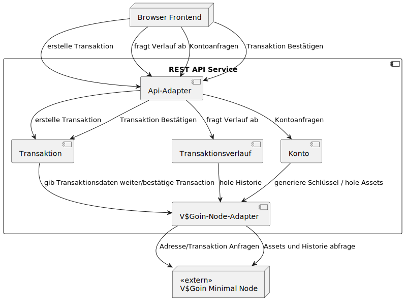

# 

**Über arc42**

arc42, das Template zur Dokumentation von Software- und
Systemarchitekturen.

Template Version 9.0-DE. (basiert auf der AsciiDoc Version), Juli 2025

Created, maintained and © by Dr. Peter Hruschka, Dr. Gernot Starke and
contributors. Siehe <https://arc42.org>.

# Einführung und Ziele

## Aufgabenstellung
### Inhalt

Das System dient der Verwaltung und Abwicklung von digitalen Währungstransaktionen zwischen Nutzern und erleichtert den Nutzern die Interaktion mit der in der Blockchain repräsentierte Währung.  
Kernfunktionalität ist das Anzeigen von Kontoständen und Transaktionsverläufen sowie die Durchführung und Nachverfolgung von Überweisungen zwischen Nutzern.
Darüber hinaus werden Funktionalitäten für die Schlüsselerzeugung geboten.

Treibende Kräfte sind die Notwendigkeit einer einfachen, transparenten und zuverlässigen Plattform für Transaktionen sowie die Nachvollziehbarkeit aller Bewegungen im System unserers V$Goins.

**Verweise auf Anforderungsdokumente:**
- *User Stories, abgelegt in den [GitHub Issues](https://github.com/users/bjoern621/projects/5/views/1?filterQuery=-status%3ABacklog+label%3A%22rest-api%22)

---

### Motivation

Ziel ist es, Nutzern eine intuitive Möglichkeit zu bieten, digitale Währungen untereinander zu übertragen.  
Das System verbessert die Nachvollziehbarkeit und Transparenz von Transaktionen, reduziert manuelle Fehler und schafft Vertrauen zwischen den Beteiligten.

Aus fachlicher Sicht wird damit die grundlegende Aufgabe der sicheren Kontoführung und Transaktionsverwaltung erfüllt, was den zentralen Mehrwert des Systems darstellt.

---

### Form

| **Use Case / Aufgabe**                          | **Beschreibung**                                                                                                                                                         | User Stories                                                                                 |
|-------------------------------------------------|--------------------------------------------------------------------------------------------------------------------------------------------------------------------------|----------------------------------------------------------------------------------------------|
| Währung senden                                  | Ein Nutzer kann einem anderen Nutzer einen beliebigen Betrag seiner verfügbaren Währung übertragen. Das System prüft, ob der Sender über ausreichendes Guthaben verfügt. | [US-23 Transaktion](https://github.com/bjoern621/VSP-Blockchain/issues/23)                   |
| Kontostand anzeigen                             | Ein Nutzer kann seinen aktuellen Kontostand einsehen.                                                                                                                    | [US-26 Kontostand einsehen](https://github.com/bjoern621/VSP-Blockchain/issues/26)           |
| Transaktionsverlauf anzeigen                    | Ein Nutzer kann alle vergangenen Transaktionen seines Kontos einsehen, inklusive gesendeter und empfangener Beträge.                                                     | [US-27 Transaktionsverlauf einsehen](https://github.com/bjoern621/VSP-Blockchain/issues/27)  |
| Ein neuen privaten Schlüssel erzeugen           | Ein Nutzer kann ein neuen privaten Schlüssel generieren lassen, mit welchem er Transaktionen durchführen kann                                                            | [US-154 privaten Schlüssel generieren lassen](https://github.com/bjoern621/VSP-Blockchain/issues/154) |
| V$Adresse von einem privaten Schlüssel erhalten | Ein Nutzer kann mithilfe eines privaten Schlüssels die dazugehörige V$Adresse erhalten                                                                                   | [US-155 V$Adresse erhalten](https://github.com/bjoern621/VSP-Blockchain/issues/155)                                                                |                                                                                              |                                                                                              |                                                                                              |                                                                                                                                                                          |

Alle genannten Anforderungen basieren auf den oben referenzierten User Stories und Akzeptanzkriterien.

## Qualitätsziele

### Inhalt

Die folgenden Qualitätsziele repräsentieren die für die Architektur maßgeblichen Anforderungen gemäß den wichtigsten Stakeholdern.  
Sie orientieren sich an den Qualitätsmerkmalen des ISO/IEC 25010 Standards.

---

### Qualitätsziele

| **Priorität** | **Qualitätsziel**           | **Beschreibung**                                                                                                                                                                    |
|---------------|-----------------------------|-------------------------------------------------------------------------------------------------------------------------------------------------------------------------------------|
| 1             | **Sicherheit** | Alle Transaktionen müssen vor unbefugtem Zugriff geschützt sein. Authentifizierung und Autorisierung sind zentrale Punkte des Systems.                                              |
| 2             | **Zuverlässigkeit** | Das System muss Transaktionen konsistent und fehlerfrei verarbeiten. Datenintegrität hat höchste Priorität, insbesondere bei Transaktionen.                                         |
| 3             | **Wartbarkeit** | Der Quellcode und die Systemarchitektur sollen modular aufgebaut sein, um zukünftige Änderungen (z. B. neue Währungsarten oder Sicherheitsfunktionen) leicht integrieren zu können. |
| 4             | **Performance** | Transaktionen und Kontostandsabfragen sollen ohne merkliche Verzögerung ausgeführt werden, um ein reaktionsschnelles Nutzererlebnis zu gewährleisten.                               |

---
## Stakeholder

| Rolle         | Kontakt               | Erwartungshaltung                                                                                                                      |
|---------------|-----------------------|----------------------------------------------------------------------------------------------------------------------------------------|
| **Product Owner** | wqx847@haw-hamburg.de | Erwartet, dass das System alle Kernfunktionen wie Überweisungen und Transaktionshistorie zuverlässig bereitstellt.                     |
| **Endnutzer / Konto-Inhaber** | n/a                   | Erwartet eine sichere, transparente und einfach bedienbare Plattform, um Währung zu senden, zu empfangen und Transaktionen einzusehen. |
| **Entwicklungsteam** | [GitHub](https://github.com/bjoern621/VSP-Blockchain)            | Erwartet eine stabile und verfügbare Versionsverwaltung (GitHub) und einen stabilen Main branch (durch Code Reviews gesichert)         |

# Randbedingungen

## Technische Randbedingungen

| **Randbedingung** | **Erläuterung**                                                                                                                                                                          |
|--------------------|------------------------------------------------------------------------------------------------------------------------------------------------------------------------------------------|
| **Blockchain-Anbindung** | Das System spiegelt reale Währungswerte über eine bestehende **Blockchain-Infrastruktur** wider. Transaktionen im System müssen mit der entsprechenden Blockchain synchronisiert werden. |
| **Blockchain-Protokoll** | Es wird die **V$Goin-Blockchain** verwendet.                                                                                                                                             |
| **Deployment-Umgebung** | Das System wird in der **Cloud-Umgebung** der HAW (ICC) betrieben.                                                                                                                       |

---

## Organisatorische Randbedingungen

| **Randbedingung** | **Erläuterung**                                                                            |
|--------------------|--------------------------------------------------------------------------------------------|
| **Entwicklungsteam** | Das Projekt wird von einem Entwicklungsteam mit 4 Entwicklern umgesetzt.                   |
| **Dokumentationsstandard** | Architektur und Anforderungen werden nach dem **arc42-Template** gepflegt und versioniert. |

---

## Rechtliche und sicherheitsrelevante Randbedingungen

| **Randbedingung** | **Erläuterung** |
|--------------------|-----------------|
| **Backup & Recovery** | Die Transaktionsdaten sind durch die zugrunde liegende Blockchain dezentral und revisionssicher gespeichert. |

---


# Kontextabgrenzung

## Fachlicher Kontext


| **Kommunikationspartner**                      | **Eingabe an das System**                               | **Ausgabe vom System**                                                                         |
|------------------------------------------------|---------------------------------------------------------|------------------------------------------------------------------------------------------------|
| **Endnutzer**                   | Private Keys, Transaktionsaufträge, Kontostand-Anfragen | Bestätigungsmeldungen, Transaktionshistorie, aktueller Kontostand                              |
| **V$Goin Blockchain-System**                   | Transaktionsdaten, Public Key Hash                      | Transaktionsbestätigungen, UTXOs (verfügbare Zahlungsmittel), Transaktionsverläufe, Event-Logs |
| **Monitoring- oder Logging-Systeme**   | Statusabfragen, Metriken                                | Logs, Health-Check-Responses                                                                   |

## Technischer Kontext


<details>
    <summary>Code</summary>
    
    ````plantuml
    @startuml
    node "Browser Frontend" as browser
    
    component "REST API Service" as api
    
    node "Lokale V$Goin Node" as localNode
    node "V$Goin-Blockchain" as blockChain
    
    ' Lollipop-Schnittstelle am REST API Service
    interface " " as apiInterface
    apiInterface -- api
    
    ' Browser nutzt die Schnittstelle
    browser --( apiInterface : synchron
    
    ' REST API hängt von Blockchain ab
    interface " " as blockchainApi
    blockchainApi -- localNode
    api --( blockchainApi : synchron
    localNode -right-> blockChain : asynchron
@enduml
    ````
</details>


| **Kommunikationspartner**    | **Technische Schnittstelle / Kanal** | **Protokoll / Datenformat** | **Beschreibung / Bemerkung**                                                                                      |
|------------------------------|--------------------------------------|-----------------------------|-------------------------------------------------------------------------------------------------------------------|
| **REST API**                 | HTTPS REST-API                       | JSON                        | Zugriff über Weboberfläche auf Konto- und Transaktionsfunktionen                                                  |
| **Lokale V$Goin Node**       | gRPC                                 | Byte                        | Kommunikation mit Blockchain-Knoten zum Senden und Prüfen von Transaktionen, sowie erhalten von Transaktionsdaten |
| **V$Goin Blockchain-System** | gRPC                                 | Byte                        | Weiterleiten der erstellten Transaktion an alle weiteren Knoten                                                   |

# Lösungsstrategie
## Technologieentscheidungen
- **Programmiersprache:** Go  
  Go wurde gewählt, da es eine hoch performante Sprache ist und eingebaute Nebenläufigkeit (Goroutines) besitzt.

- **Kommunikationsprotokolle:**
    - **gRPC:** Für performante Kommunikation zu Miner-Network.
    - **REST:** Für einfache externe Anbindungen (Frontend).  
      → gRPC bietet hohe Effizienz und Typsicherheit, REST bleibt für Interoperabilität und menschliche Lesbarkeit bestehen.

- **Frameworks / Tools:**
    - `Docker` zur Containerisierung der Nodes

---

## Top-Level-Architekturentscheidungen
- **Architekturmuster:**  
  Mehrschichtige Client-Server Architektur mit einer Facade für REST Request von Nutzern, einem Backend, welches die Anfragen der Nutzer annimmt und an eine lokalen V$Goin Node weiterleitet, welches die Anfragen verarbeitet und an die restlichen Knoten im System weiterleitet.


---

## Entscheidungen zur Erreichung der wichtigsten Qualitätsziele

| **Priorität** | **Qualitätsziel** | **Maßnahmen / Architekturentscheidungen**                                                                                                                                                |
|---------------|------------------|------------------------------------------------------------------------------------------------------------------------------------------------------------------------------------------|
| **1** | **Sicherheit** | Verwendung von Signaturen für Transaktionsauthentizität.                                 |
| **2** | **Zuverlässigkeit** | Validierung jeder Transaktion durch Mehrheitskonsens der Nodes. Unveränderliche Hash-Ketten sichern Datenintegrität. |
| **3** | **Wartbarkeit** | Strikte Modultrennung. Pipeline Stages für Code Qualität                                                                                                                                 |
| **4** | **Performance** | gRPC für effiziente Node-Kommunikation. Nebenläufige Verarbeitung (Goroutines) für Transaktionsvalidierung.                                                                              |

# Bausteinsicht

## Whitebox Gesamtsystem

<details>
    <summary> Code </summary>

    ````plantuml
    @startuml
    node "Browser Frontend" as browser

    ' =====================
    '   System Boundary
    ' =====================
    component "REST API Service" as api {
    
        component "Api-Adapter" as api_adapter
        component "Transaktion" as transaction
        component "Transaktionsverlauf" as verlauf
        component "Konto" as konto
        component "V$Goin-Node-Adapter" as adapter
    }
    
    ' =====================
    '   External Library
    ' =====================
    node "<<extern>>\nV$Goin SPV Node" as lib 
    
    
    
    ' ---------------------------------------------
    ' Browser → System
    ' ---------------------------------------------
    browser --> api_adapter: erstelle Transaktion
    browser --> api_adapter: fragt Verlauf ab
    browser --> api_adapter: Kontoanfragen
    

    ' ---------------------------------------------
    ' Api Adapter → System
    ' ---------------------------------------------
    api_adapter --> transaction : erstelle Transaktion
    api_adapter --> verlauf : fragt Verlauf ab
    api_adapter --> konto : Kontoanfragen

    ' ---------------------------------------------
    ' System intern
    ' ---------------------------------------------
    transaction --> adapter : gib Transaktionsdaten weiter
    verlauf     --> adapter : hole Historie
    konto     --> adapter : generiere Schlüssel / hole Assets
    
    ' ---------------------------------------------
    ' Adapter → Library
    ' ---------------------------------------------
    adapter --> lib : Adresse/Transaktion Anfragen
    adapter --> lib  : Assets und Historie abfrage
    @enduml
    ````
</details>


## Blackboxes Ebene 1
### Inhaltsverzeichnis
1. [Api-Adapter](#api-adapter-blackbox)
2. [Transaktion](#transaktion-blackbox)
3. [Transaktionsverlauf](#transaktionsverlauf-blackbox)
4. [Konto](#konto-blackbox)
5. [V$Goin-Node-Adapter](#vgoin-node-adapter-blackbox)

---

### Api-Adapter (Blackbox)

#### Zweck / Verantwortung
- Sammlung aller REST-Endpunkte der API
- Übersetzung der API Aufrute zu internen Systemaufrufen
- Entkopplung des Systems von Änderungen der Schnittstellen-Implementierung
- Beinhaltet größtenteils generierten Code des OpenAPI Generators

#### Schnittstellen
- REST-Endpunkt post /transaction
- REST-Endpunkt get /history
- REST-Endpunkt get /balance
- REST-Endpunkt get /address
- REST-Endpunkt get /address/new
- [OpenAPI Spezifikation](../../../rest-schnittstelle/openapi.yaml)


### Transaktion (Blackbox)

#### Zweck / Verantwortung
- Entgegennahme und Umwandlung von Transaktionsanfragen
- Weitergabe der Signaturerstellung und verbreiten im Netzwerk durch den Adapter

#### Eingaben / Ausgaben
- Eingaben: Transaktionsdaten vom Client
- Ausgaben: Erfolgs- oder Fehlermeldungen

#### Abhängigkeiten
- V$Goin-Node-Adapter (Weiterleitung)

#### Erfüllte Anforderungen
- [US-23 Transaktion](https://github.com/bjoern621/VSP-Blockchain/issues/23)

#### Qualitätsanforderungen
- Zuverlässigkeit: Ungültige Transaktionen werden abgelehnt

---

### Transaktionsverlauf (Blackbox)

#### Zweck / Verantwortung
- Bereitstellung der Transaktionshistorie für einen bestimmte V$Adresse

#### Eingaben / Ausgaben
- Eingaben: V$Adresse
- Ausgaben: Liste von Transaktionen

#### Abhängigkeiten
- V$Goin-Node-Adapter (History-Abfrage)

#### Erfüllte Anforderungen
- [US-27 Transaktionsverlauf einsehen](https://github.com/bjoern621/VSP-Blockchain/issues/27)

#### Qualitätsanforderungen
- Performance: 99% der Antworten in unter 2s

---

### Konto (Blackbox)

#### Zweck / Verantwortung
- Bereitstellung des Kontostands für eine V$Adresse
- Generierung privater Schlüssel
- Ableitung der V$Adresse aus einem Private Key

#### Schnittstelle
- REST-Endpunkte /balance und /address
- [OpenAPI Spezifikation](../../../rest-schnittstelle/openapi.yaml)

#### Eingaben / Ausgaben
- Eingaben: V$Adresse, Private Key WIF
- Ausgaben: Balance, V$Adresse, Private Key WIF

#### Abhängigkeiten
- V$Goin-Node-Adapter (Key-Funktionen, Balance, Key-Ableitung)

#### Erfüllte Anforderungen
- [US-26 Kontostand einsehen](https://github.com/bjoern621/VSP-Blockchain/issues/26)
- [EPIC-24 Konto erstellen](https://github.com/bjoern621/VSP-Blockchain/issues/24)
- [EPIC-94 V$Adresse erhalten](https://github.com/bjoern621/VSP-Blockchain/issues/94)

#### Qualitätsanforderungen
- Performance: 99% der Antworten in unter 2s

---

### V$Goin-Node-Adapter (Blackbox)

#### Zweck / Verantwortung
- Einzige Schnittstelle zur lokalen SPV-Node
- Übersetzung der internen Systemaufrufe zur V$Goin RPC Schnittstelle
- Entkopplung des Systems von V$Goin-Änderungen

#### Schnittstelle
- Funktionen: Signatur, Key-Generierung, Key-Ableitung, Historie, Balance, Broadcast
- [Schnittstellen P2P Netzwerk Wiki](https://github.com/bjoern621/VSP-Blockchain/wiki/Externe-Schnittstelle-Mining-Network)

#### Eingaben / Ausgaben
- Eingaben: Transaktionsdaten, Wallet Adressen, Private Keys
- Ausgaben: normalisierte Ergebnisse aus der Node

## Ebene 2

### Whitebox *\<Konto\>*

<details>
    <summary>Code</summary>
    
    ````plantuml
    @startuml
    title Level 2 – Komponente "Konto"
    
    skinparam interfaceStyle uml
    
    package "Konto" {
    
        component "Adresse" as Adresse
    
        component "Kontostand" as Kontostand
    }
    
    interface "KontoAdapter" as IBalanceReq
    Kontostand --( IBalanceReq : <<requires>>
    interface "Keys" as KeyReq
    Adresse --( KeyReq : <<requires>>
    @enduml
    ````
</details>

### Whitebox *\<V$Goin-Node-Adapter\>*


<details>
    <summary>Code</summary>
    
    ````plantuml
    @startuml
    title Level 2 – Komponente "V$Goin-Node-Adapter"
    
    skinparam interfaceStyle uml
    
    package "V$Goin-Node-Adapter" {
    
        component "Transaction-Adapter" as WalletAdapter
    
        component "Konto-Adapter" as NetworkAdapter

        component "Transaktionsverlauf-Adapter" as HistoryAdapter
    }
    interface "V$Goin Node" as Node
    WalletAdapter -down-( Node : <<requires>>
    NetworkAdapter --down( Node : <<requires>>
    interface "Keys" as IKeyProv
    WalletAdapter -up- IKeyProv : <<provides>>
    interface "Transaction" as TransactionProv
    WalletAdapter -up- TransactionProv : <<provides>>
    interface "KontoAdapterAPI" as IBalanceProv
    NetworkAdapter -up- IBalanceProv : <<provides>>
    interface "HistoryAPI" as IHistoryProv
    HistoryAdapter -up- IHistoryProv : <<provides>>
    HistoryAdapter --down( Node : <<requires>>
    @enduml
    ````
</details>

# Laufzeitsicht

# Verteilungssicht

## Infrastruktur Ebene 1

<details>
    <summary>Diagramm Code</summary>

    ````plantuml
    @startuml
    skinparam componentStyle rectangle
    
    cloud "Internet" {
      node "Client" as Client
    }
    
    
    node "«Environment»\nHAW-ICC" {
        top to bottom direction
        node "«Ingress»\n reverse proxy"  as ingress
        node "«Service»\n restAPI" {
          
          component "«Pod»\n restAPI replica: 1" as restApi1
          component "«Pod»\n restAPI replica: 2" as restApi2
          component "«Pod»\n restAPI replica: n" as restApin
        }
    }
    Client --> ingress : HTTPS
    ingress --> restApi1 : HTTP
    ingress --> restApi2 : HTTP
    ingress --> restApin : HTTP
    
    @enduml
    ````
</details>

### Umstände 
In diesem Dokument wird die Infrastruktur beschrieben, auf welcher die von uns betriebenen Komponenten laufen.
Unsere Komponenten werden in der HAW-ICC betrieben. Sämtliche von uns betriebenen Komponenten müssen folglich eine der von
[Kubernetes unterstützen Container Runtime](https://kubernetes.io/docs/concepts/containers/#container-runtimes) implementieren.
Für uns bedeutet dies, dass jede Komponente als Docker-Container gebaut und deployt wird.
Diese nutzen ein Debian Image als Grundlage. Die Kommunikation zwischen den Containern wird durch gRPC erfolgen. Dazu muss an jedem Container ein Port geöffnet werden.
Alle Container, welche Teil des Mining-Systems sind, werden als ein gemeinsamer Service deployt.

### Beschreibung
Aufrufe von Clients kommen per HTTPS über den Ingress in das Cluster. Der Ingress wird durch einen NGINX-basierten Reverse Proxy realisiert, der die TLS-Terminierung übernimmt.
Dieser fungiert gleichzeitig als Loadbalancer, welcher den Traffic auf beliebig viele Replicas der restAPI Pods per Round-Robin-Verfahren verteilt.
Die Anzahl der Replicas kann über den restAPI Service manuell statisch eingestellt werden.

### Qualitäts- und/oder Leistungsmerkmale
Es muss sich an die von der HAW-ICC vorgeschriebenen Ressourcenquoten gehalten werden. Aktuell sind diese Limits wie folgt:

| CPU      | RAM   | Speicher | #Pods | #Services | #PVCs |
|----------|-------| -------- | ----- | --------- | ----- |
| 16 Kerne | 16 GB | 100 GB   | 50    | 10        | 5     |
Diese Ressourcen müssen sich mit dem Minernetwork geteilt werden, da diese im gleichen Cluster laufen.

Diese Limits wurden bereits nach Nachfrage per E-Mail angehoben. Es gilt weiter den Ressourcenverbrauch im Auge zu behalten und ggfs. zu reagieren.


## Infrastruktur Ebene 2

<details>
    <summary>Diagramm Code</summary>

    ````plantuml
    @startuml
    skinparam componentStyle rectangle
      left to right direction
    
          node "«Pod»\n restApi"{
            component "«Container»\n restAPI" as api
            component "«Container»\n full Node" as fullNode
          }
          api <--> fullNode : gRPC
    @enduml
    ````
</details>

### Beschreibung
In dem restAPI Pod ist die restAPI und eine full Node enthalten.
Die restAPI ist die Komponente, welche in diesem Dokument beschrieben wird. 
Die full Node ist eine Komponente aus dem Miner Network Projekt. Diese liefert dem restAPI Container die benötigten Inhalte aus dem Miner Network.
Zusätzlich ist der Full Node Container über gRPC mit anderen Full Nodes im Miner Network verbunden, um die Datenversorgung sicherzustellen.


# Querschnittliche Konzepte

## 1. Fachliche Konzepte

### 1.1 Domänenmodell V$Goin
Das System bildet ein vereinfachtes Blockchain-basiertes Zahlungssystem ab.  
Zentrale fachliche Objekte sind:

- V$Adresse (base 58 check kodierter doppelter SHA-256 Hash eines öffentlicher Schlüssel) der Länge 33 oder 34 bytes
- Private Key WIF (zur Signatur)
- UTXO / Assets (nicht ausgegebene Transaktionseinheiten)
- Transaktion (signiertes Transferobjekt, welches den Besitzwechsel von Währung repräsentiert)
- Historie (Liste verifizierter Transaktionen)

### 1.2 Validierungsregeln
- Jede Transaktion muss gültig signiert sein.
- Ausreichende UTXOs müssen für Transaktionen verfügbar sein.
- Adressen und Schlüssel dürfen nur Base58 encoded.
- Unvollständige Eingangsdaten werden frühzeitig im API validiert, aber fehlerhafte Daten können erst durch lokale V$Goin-Node validiert werden.

## 2. Persistenz- und Datenhaltungskonzept

### 2.1 Persistenzstrategien
Das System speichert selbst **keine eigenen Blockchain-Daten**, sondern fragt Assets (UTXOs) und Historien dynamisch über die lokale V$Goin Node ab.  
Temporäre Daten:

- JSON als API-Format, binäre Formate der V$Goin Blockchain

### 2.2 Formatkonzept
- V$Adressen → String (33 oder 34 bytes)
- Private Key WIFs → String 
- Transaktionen → binäre V$Goin-Formate, API JSON

## 3. Kommunikations- und Integrationskonzept

### 3.1 Architekturprinzip
- Der Adapter kapselt sämtliche Interaktionen mit der SPV-Node.
- Das Backend ist vollständig entkoppelt von Blockchain-gRPC-Details.

### 3.2 Kommunikationsmechanismen
- Browser ↔ API: REST/HTTPS
- API ↔ Adapter: interne Funktionsaufrufe
- Adapter ↔ Node: RPC Aufrufe
- Node ↔ Blockchain: gRPC-Kommunikation

### 3.3 Schnittstellen
- Schnittstellen sind in der [OpenAPI Spezifikation](../../../rest-schnittstelle/openapi.yaml) dokumentiert.

## 4. Code-Qualität
- Automatisierte Tests
- Statische Analyse (Sonar)
- Architekturrichtlinienchecks
- Manuelle Code Reviews vor jedem Merge

## 5. Adapter-Pattern
Das System verwendet ein komponentenweites Adapter-Muster, um die V$Goin-Node von der fachlichen Logik der API zu entkoppeln.  
Der Adapter kapselt sämtliche Low-Level-Funktionen der Node und stellt eine stabile interne Schnittstelle bereit.  
Dadurch können Änderungen an der Blockchain-Technologie vorgenommen werden, ohne das Backend groß anzupassen.

**Motivation:**
- Keine Abhängigkeiten alle Komponenten direkt zur RPC Schnittstelle
- Austauschbarkeit der Blockchain-Implementierung
- Einheitliche Formate intern

# Architekturentscheidungen
## ADR 1: Verwendung von Go als Backend-Programmiersprache
**Status:** Akzeptiert  
**Datum:** 2025-10

### Entscheidung
Das Backend-System wird in der Programmiersprache **Go** implementiert.
### Kontext
Das System interagiert häufig mit externen APIs der V$-Blockchain und internen Services, benötigt hohe Nebenläufigkeitsleistung und effiziente Ressourcennutzung.
### Begründung
Go bietet exzellente Unterstützung für Nebenläufigkeit (Goroutinen), schnelle Ausführung, geringen Speicherverbrauch und erzeugt statische Binaries, die den containerisierten Betrieb vereinfachen.
### Konsequenzen
\+ Hohe Performance bei gleichzeitigen Operationen <br>
\+ Vereinfachte Bereitstellung in Docker <br>
– Ein Teil des Teams weniger Erfahrung mit dieser Sprache  <br>

## ADR 2: Externe APIs als REST/JSON bereitstellen

**Status:** Akzeptiert  
**Datum:** 2025-10

### Entscheidung
Alle externen APIs werden im **REST-Architekturstil** mit **JSON** als Datenaustauschformat umgesetzt.

### Kontext
Endnutzer brauchen verständliche Schnittstelle und externer Client benötigen einfache Schnittstellen.

### Begründung
REST/JSON ist leicht verständlich und dokumentierbar und funktioniert ohne spezielle Tools.

### Konsequenzen
\+ Einfache Integration für Partner <br>
\+ Gute Debugging- und Tool-Unterstützung  <br>
– Geringere Typensicherheit als gRPC  <br>

# Qualitätsanforderungen

## Übersicht der Qualitätsanforderungen
|**Qualitätsziel**           | **Beschreibung**                                                                                                                                                                    | Messkriterium                                                                                                                            |
|-----------------------------|-------------------------------------------------------------------------------------------------------------------------------------------------------------------------------------|------------------------------------------------------------------------------------------------------------------------------------------|
|**Sicherheit** | Alle Transaktionen müssen vor unbefugtem Zugriff geschützt sein. Authentifizierung und Autorisierung sind zentrale Punkte des Systems.                                              | 100% der Transaktionen werden vom V$-Blockchain System verfiziert                                                                        |
|**Zuverlässigkeit** | Das System muss Transaktionen konsistent und fehlerfrei verarbeiten. Datenintegrität hat höchste Priorität, insbesondere bei Transaktionen.                                         | 100% der falschen Transaktion werden vom V$-Blockchain System abgelehnt                                                                  |
|**Wartbarkeit** | Der Quellcode und die Systemarchitektur sollen modular aufgebaut sein, um zukünftige Änderungen (z. B. neue Währungsarten oder Sicherheitsfunktionen) leicht integrieren zu können. | Jeder Merge in den Main absolviert alle Codequalitätsstages der Pipeline (Test, Sonar, Architecture-Checking) und wurde manuell reviewed |
|**Performance** | Transaktionen und Kontostandsabfragen sollen ohne merkliche Verzögerung ausgeführt werden, um ein reaktionsschnelles Nutzererlebnis zu gewährleisten.                               | Nutzer erhalten in 99% der Fällen eine Antwort innerhalb 2s                                                                              |

## Qualitätsszenarien

### Szenario 1: Sichere Transaktionsverarbeitung
| **Attribut**        | **Beschreibung**                                                                                                   |
|---------------------|---------------------------------------------------------------------------------------------------------------------|
| **Qualitätsziel**   | Sicherheit                                                                                                          |
| **Stimulus**        | Ein Nutzer sendet einen Transaktionsauftrag mit ungültigem Private Key WIF                                          |
| **Quelle**          | Endnutzer über REST API                                                                                             |
| **Umgebung**        | Normaler Betrieb                                                                                                    |
| **Artefakt**        | POST `/transaction` Endpunkt                                                                                        |
| **Antwort**         | Das System validiert das WIF-Format und lehnt ungültige Keys mit HTTP 401 ab |
| **Metrik**          | 100% der ungültigen Keys werden erkannt und abgelehnt                                 |

### Szenario 2: Performance bei Kontostandabfragen
| **Attribut**        | **Beschreibung**                                                                                                   |
|---------------------|---------------------------------------------------------------------------------------------------------------------|
| **Qualitätsziel**   | Performance                                                                                                         |
| **Stimulus**        | Ein Nutzer ruft seinen Kontostand ab                                                                                |
| **Quelle**          | Endnutzer über REST API                                                                                             |
| **Umgebung**        | Normaler Betrieb mit funktionierender lokaler Node                                                                  |
| **Artefakt**        | GET `/balance` Endpunkt, `KontoAdapter`                                                                             |
| **Antwort**         | Der Request wird synchron über gRPC an die lokale Node weitergeleitet und die Summe der Assets berechnet            |
| **Metrik**          | 99% aller Antworten in < 2 Sekunden                                                                                 |

### Szenario 3: Modulare Erweiterbarkeit
| **Attribut**        | **Beschreibung**                                                                                                   |
|---------------------|---------------------------------------------------------------------------------------------------------------------|
| **Qualitätsziel**   | Wartbarkeit                                                                                                         |
| **Stimulus**        | Ein Entwickler möchte einen neuen Endpunkt hinzufügen                                                               |
| **Quelle**          | Entwicklungsteam                                                                                                    |
| **Umgebung**        | Entwicklungszeit                                                                                                    |
| **Artefakt**        | Adapter-Schicht (`vsgoin_node_adapter`), API-Adapter (`api_adapter`)                                                |
| **Antwort**         | Durch strikte Trennung von API-Layer, Domain-Layer und Adapter-Layer kann ein neuer Endpunkt in < 1 Tag umgesetzt werden |
| **Metrik**          | Änderungen an der gRPC-Schnittstelle erfordern nur Anpassungen im `vsgoin_node_adapter`-Package                     |


# Risiken und technische Schulden

## Risiken

| **Risiko**                                     | **Beschreibung**                                                                                                                                                              | **Eintrittswahrscheinlichkeit** | **Auswirkung** | **Maßnahmen**                                                                                          |
|------------------------------------------------|-------------------------------------------------------------------------------------------------------------------------------------------------------------------------------|--------------------------------|----------------|--------------------------------------------------------------------------------------------------------|
| **Ausfall der lokalen V$Goin Node**            | Die REST API ist vollständig abhängig von der lokalen Node. Bei Ausfall der Node sind keine Transaktionen oder Abfragen möglich.                                              | Mittel                          | Hoch           | Monitoring, Health-Checks, ggf. Fallback auf alternative Node                                          |
| **gRPC-Verbindungsprobleme**                   | Netzwerkprobleme zwischen REST API Container und Node Container können zu Timeouts führen.                                                                                    | Niedrig                         | Mittel         | Connection Pooling, Retry-Logik (aktuell nicht implementiert)                                          |
| **Ressourcenengpässe im ICC-Cluster**          | Die HAW-ICC Ressourcenquoten (16 CPU, 16 GB RAM) müssen mit dem Miner-Network geteilt werden.                                                                                  | Mittel                          | Mittel         | Regelmäßiges Monitoring, bei Bedarf Quota-Erhöhung beantragen                                          |
| **Änderungen an der V$Goin-Node-Schnittstelle**| Änderungen am gRPC-Protokoll der Node erfordern Anpassungen im Adapter.                                                                                                       | Mittel                          | Niedrig        | Adapter-Pattern isoliert Änderungen, klare Versionierung der Protobuf-Dateien                          |

## Technische Schulden

| **Schuld**                                        | **Beschreibung**                                                                                                                          | **Priorität** | **Aufwand**    | **Maßnahmen**                                                                                          |
|---------------------------------------------------|-------------------------------------------------------------------------------------------------------------------------------------------|---------------|----------------|--------------------------------------------------------------------------------------------------------|
| **Keine TLS/mTLS für interne gRPC-Kommunikation** | Die gRPC-Verbindung zur lokalen Node nutzt `insecure.NewCredentials()`. Die Kommunikation ist unverschlüsselt.                            | Mittel | Mittel | Einführung von TLS-Zertifikaten für Pod-zu-Pod-Kommunikation |
| **Fehlende Retry-Logik bei gRPC-Aufrufen**        | Bei temporären Verbindungsproblemen zur Node gibt es keine automatischen Wiederholungsversuche.                                           | Niedrig       | Niedrig        | Implementierung von Exponential Backoff mit gRPC-Interceptors                                          |
| **Fehlende Integrationstests der Endpunkte**      | Es fehlen dedizierte Integrationstests für die API-Endpunkte. Momentan gibt es nur manuelle Tests der Endpunkte mittels Bruno             | Hoch          | Mittel         | Integrationstests mit Mock-Node oder Testcontainers implementieren                                     |
| **Generierter Code im api_adapter-Package**       | Teile des `api_adapter`-Packages sind vom OpenAPI Generator generiert. Manuelle Änderungen können bei Regenerierung überschrieben werden. | Niedrig       | Niedrig        | Klare Trennung von generiertem und manuellem Code, Nutzung von Erweiterungs-Dateien                    |
| **Fehlende Timeouts bei gRPC-Calls**              | gRPC-Aufrufe nutzen `context.Background()` ohne Timeout. Bei hängenden Nodes könnten Requests unbegrenzt warten.                          | Mittel        | Niedrig        | `context.WithTimeout()` für alle gRPC-Aufrufe einführen                                                |

# Glossar

| Begriff         | Definition         |
|-----------------|--------------------|
| **Adapter (Pattern)** | Entwurfsmuster zur Entkopplung zwischen Fachlogik und externer Schnittstelle: Der *V$Goin-Node-Adapter* kapselt alle Low-Level-Aufrufe an die lokale Node und stellt eine stabile interne API bereit. |
| **Asset** | Im Kontext dieser Dokumentation Synonym zu **UTXO**: eine nicht ausgegebene Transaktionseinheit, die als „verfügbares Zahlungsmittel“ für neue Transaktionen genutzt werden kann. |
| **Balance / Kontostand** | Summe der für eine Adresse verfügbaren Werte (typischerweise basierend auf UTXOs), abrufbar über den REST-Endpunkt `/balance`. |
| **Base58 / Base58Check** | Kodierungsverfahren für Adressen und Keys, das gut lesbare Zeichen verwendet; **Base58Check** ergänzt zusätzlich eine Prüfsumme zur Erkennung von Tippfehlern. |
| **Blockchain** | Verteiltes, unveränderliches Transaktionsregister der **V$Goin-Blockchain**, das Besitzwechsel (Transaktionen) nachvollziehbar speichert und repliziert. |
| **Elliptische Kurve secp256k1** | Kryptografischer Standard (Elliptic Curve), der zur Ableitung von Public Keys aus Private Keys genutzt wird; Grundlage für Signaturen/Key-Ableitung (wie in der OpenAPI beschrieben). |
| **Hash (SHA-256)** | Kryptografische Hashfunktion; in diesem System u. a. für Key/Address-Ableitung und Integrität (z. B. im OpenAPI-Schema beschrieben) verwendet. |
| **Health Check** | Technischer Endpunkt/Mechanismus zur Überprüfung der Dienstverfügbarkeit; Ergebnisse werden z. B. an Monitoring/Logging-Systeme geliefert. |
| **Historie / Transaktionshistorie** | Liste verifizierter vergangener Transaktionen zu einer Adresse; abrufbar über den REST-Endpunkt `/history`. |
| **JSON** | Textbasiertes Datenformat für Requests/Responses der externen REST-API. |
| **Lokale V$Goin Node** | Lokale Node-Instanz, die als Gateway zur Blockchain dient.|
| **Mehrheitskonsens** | Mechanismus im Netzwerk, durch den Transaktionen/Blöcke durch mehrere Knoten bestätigt werden (vereinfacht im Dokument als Qualitätsmaßnahme für Zuverlässigkeit genannt). |
| **OpenAPI** | Standard zur Spezifikation von REST-APIs; in diesem Projekt ist die Schnittstelle in `rest-schnittstelle/openapi.yaml` beschrieben und dient als Grundlage für Code-Generierung und Dokumentation. |
| **Private Key** | Geheimnis (privater kryptografischer Schlüssel), der zum Signieren von Transaktionen verwendet wird und Besitzrechte an V$Goins kontrolliert. |
| **Private Key WIF (Wallet Import Format)** | Base58Check-kodierte Darstellung eines Private Keys (mit Präfix, Prüfsumme); wird in der API u. a. als `senderPrivateKeyWIF` (POST `/transaction`) bzw. `privateKeyWIF` (GET `/address`) verwendet. |
| **Public Key** | Öffentlicher kryptografischer Schlüssel, der aus dem Private Key abgeleitet wird (z. B. via K = k·G auf secp256k1); dient als Basis für Adressableitung. |
| **Public Key Hash / PublicKeyHash** | Hashwert des (komprimierten) Public Keys; wird Base58Check-kodiert als **VSAddress/V$Adresse** genutzt. |
| **Signatur (digitale Signatur)** | Kryptografischer Nachweis, dass eine Transaktion vom Besitzer des Private Keys autorisiert wurde; ungültige Signaturen führen zur Ablehnung der Transaktion. |
| **Transaktion** | Signiertes Transferobjekt, das einen Besitzwechsel von V$Goins repräsentiert; erzeugt aus Eingabewerten (UTXOs) und Ausgaben (Empfänger) und wird im Netzwerk broadcastet. |
| **UTXO (Unspent Transaction Output)** | Nicht ausgegebener Transaktionsausgang, der als Input für neue Transaktionen dient; entspricht den „verfügbaren Zahlungsmitteln“/Assets. |
| **V$Goin / VSGoins** | Digitale Währungseinheit, die auf der V$Goin-Blockchain geführt und übertragen wird. |
| **V$Goin-Blockchain** | Die konkrete Blockchain-Implementierung/Chain, in der V$Goin-Transaktionen verarbeitet und gespeichert werden. |
| **V$Adresse / VSAddress** | Base58Check-kodierter (komprimierter) PublicKeyHash (typisch 33–34 Zeichen), der als öffentlich teilbare Empfangsadresse dient; in der OpenAPI als Schema `VSAddress` definiert. |
