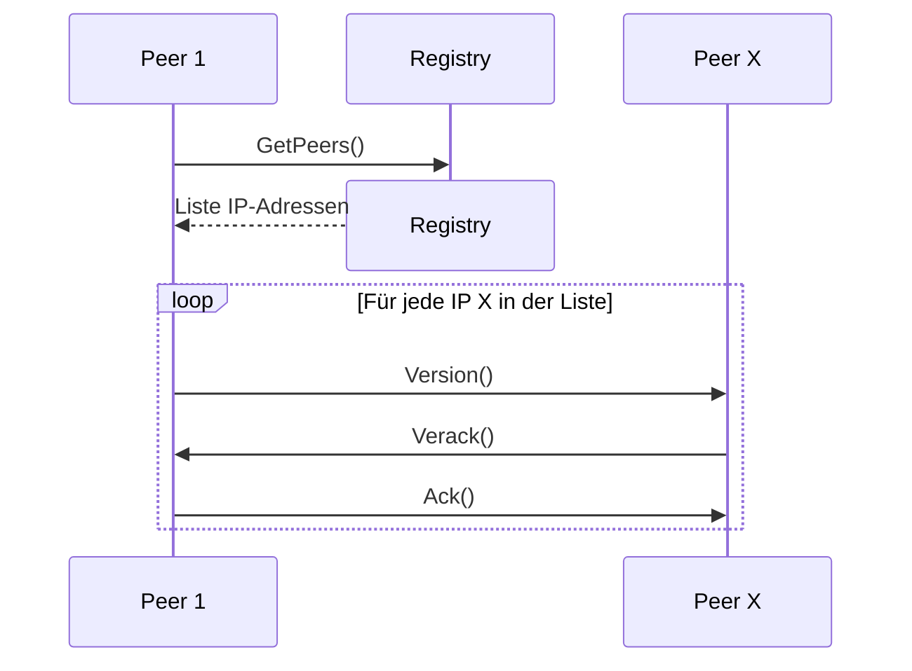
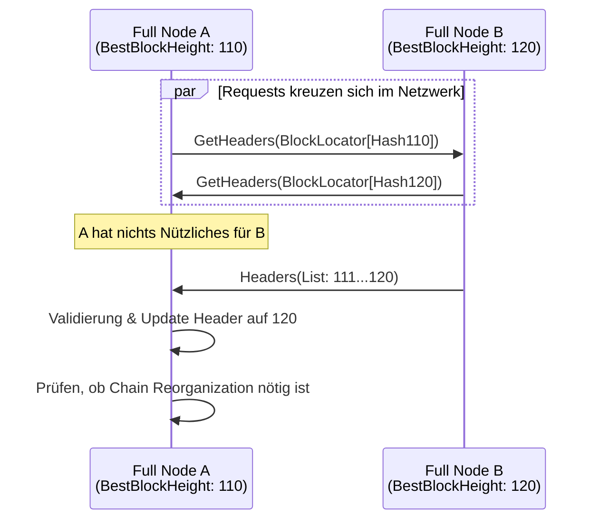
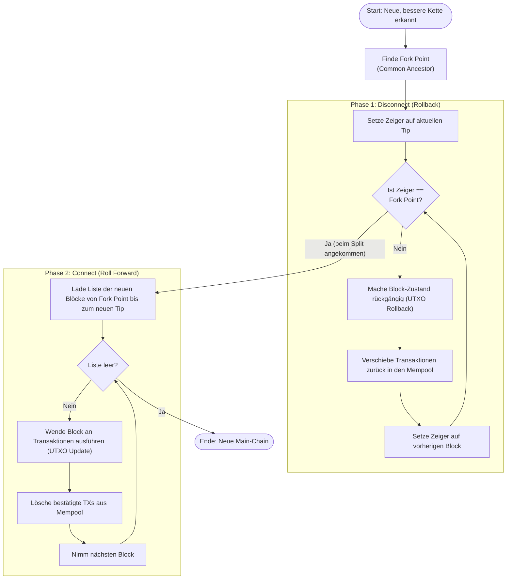
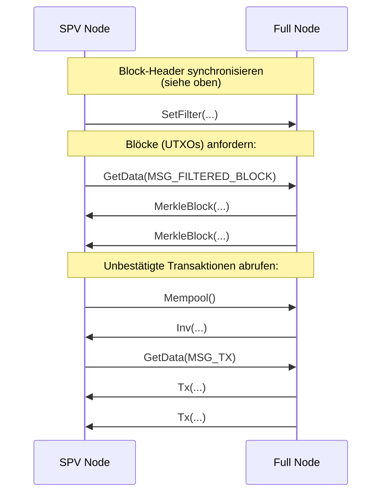
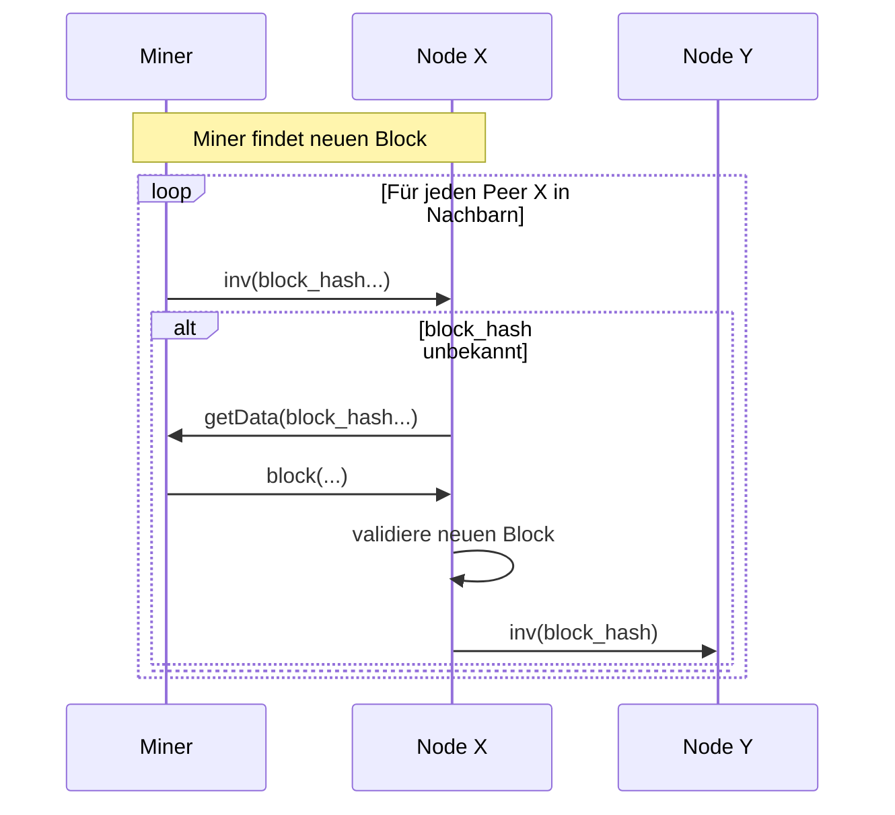
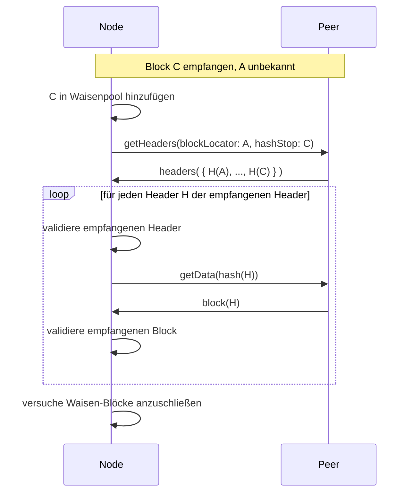
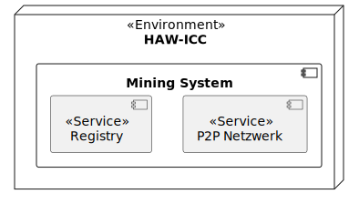
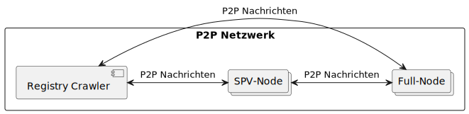
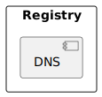
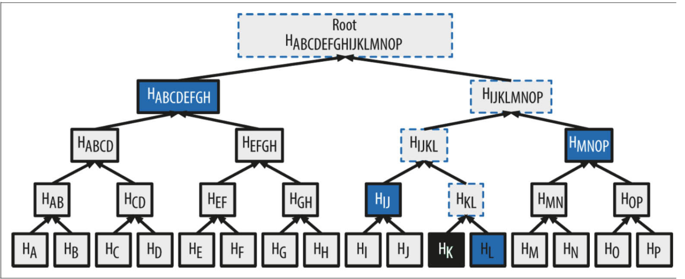

#

**Über arc42**

arc42, das Template zur Dokumentation von Software- und
Systemarchitekturen.

Template Version 9.0-DE. (basiert auf der AsciiDoc Version), Juli 2025

Created, maintained and © by Dr. Peter Hruschka, Dr. Gernot Starke and
contributors. Siehe <https://arc42.org>.

# Einführung und Ziele

Dieses Dokument beschreibt die Architektur des Peer-To-Peer (P2P)-Netzwerk für die Kryptowährung V$Goin. Im Kontext von Kryptowährungen kann dieses Netzwerk als ein öffentliches, dezentrales, Proof-of-Work orientiertes Netz eingeordnet werden. Das heißt, dass jeder Teil dieses Netzes sein kann, Transaktionen über mehrere Teilnehmer verteilt gespeichert werden und ein gewisser Rechenaufwand erforderlich ist, um die Aufgabe eines "Miners" zu erfüllen. Das Netz ist stark an existierenden Blockchains orientiert, wobei Konzepte auf grundlegendes reduziert werden.

Es gibt zwei Hauptakteure im Netzwerk: Miner und Händler. Händler sind nur an der Nutzung des Netzes orientiert. Sie geben hauptsächlich Transaktionen in Auftrag. Miner sind all die Systeme, die zur Erweiterung der Blockchain beitragen. Sie führen bestimmte kryptographische Operationen, die mit Rechenaufwand verbunden sind (Proof-of-Work), aus und ermöglichen so, dass Transaktionen getätigt werden können. Für diese Arbeit werden sie entlohnt. Sowohl Händler als auch Miner können dem Netzwerk jederzeit beitreten und verlassen.

In einem größeren Kontext wird dieses Netzwerk als verteilte Datenbank für den V$Goin genutzt und parallel mit dem System REST-API entwickelt. Die REST-API baut auf dieses Netzwerk auf und soll unseren Kunden einen benutzerfreundlicheren Zugang bieten.

## Aufgabenstellung

Das P2P-Netzwerk dient in erster Linie der Ermöglichung von Handel der Kryptowährung V$Goin in einem sicheren und dezentralen Ansatz. Die Grundanforderungen beziehen sich hauptsächlich auf die Erfüllung der Eigenschaften einer Blockchain. Besonders Erzeugung, Verteilung, Validierung und dauerhafte, unveränderliche Speicherung von Transaktionen.

Außerdem entsteht dieses System im Rahmen des Moduls "Verteilte Systeme" im Informatik Studium. Ein wichtiger Teil der Arbeit ist es daher ebenso neue Technologien (Blockchain), Architekturen (der verteilten Systeme) und Programmiersprachen (Go) kennenzulernen.

    

| Nr   | Use Case                             | Beschreibung                                                                                                                                             |
| ---- | ------------------------------------ | -------------------------------------------------------------------------------------------------------------------------------------------------------- |
| UC-1 | Währung handeln                      | Die Kryptowährung kann gehandelt werden, indem Währungsbeträge von einem Konto auf ein anderes Konto transferiert werden.                                |
| UC-2 | Kontostände lesen                    | Die Kontostände seines eigenen Kontos als auch das aller anderen Konten kann gelesen werden.                                                             |
| UC-3 | Daten verifizieren                   | Miner validieren Transaktionen und Blöcke durch kryptographische Verfahren. Händler wollen Kontostände und Transaktionen überprüfen.                     |
| UC-4 | Verbinden / Trennen aus dem Internet | Die öffentliche Blockchain soll für jeden aus dem Internet erreichbar sein. Teilnehmer treten dem P2P Netzwerk zu beliebiger Zeit bei oder verlassen es. |
| UC-5 | Blockchain synchronisieren           | Akteure gleichen ihre lokale Kopie der Blockchain mit anderen Akteuren ab, um auf dem aktuellen Stand zu bleiben.                                        |
| UC-6 | Peers finden                         | Akteure können einen Teil der vorhandenen Peers des Netzwerk entdecken und sich mit ihnen verbinden.                                                     |
| UC-7 | Block minen                          | Die Blockchain kann um kryptographisch valide Blöcke erweitert werden. Der Miner wird für den Rechenaufwand belohnt.                                     |

Vollständige Liste der Anforderungen: [GitHub Issues](https://github.com/bjoern621/VSP-Blockchain/issues?q=sort%3Aupdated-desc%20is%3Aissue%20label%3Ablockchain%20label%3AUS).

## Qualitätsziele

| Priorität | Qualitätsziel     | Motivation                                                                                                                                                                                                                                                                                                                                                |
| --------- | ----------------- | --------------------------------------------------------------------------------------------------------------------------------------------------------------------------------------------------------------------------------------------------------------------------------------------------------------------------------------------------------- |
| 1         | Understandability | Wir wollen die Konzepte von Blockchain und verteilten Systemen verstehen. Die Architektur und der Code müssen daher nachvollziehbar und gut dokumentiert sein. Es sollen Architekturmuster genutzt werden und [Go Best Practices](https://go.dev/doc/effective_go) angewandt. Dokumentation sollte kontinuierlich auf dem neuesten Stand gehalten werden. |
| 2         | Fehlertoleranz    | V$Goin ist eine Währung. Keine Beträge dürfen unbegründet entstehen oder verschwinden. Bei widersprüchlichen Daten, z. B. wenn zwei Miner gleichzeitig einen Block finden, muss stets ein gemeinsamer Konsens gefunden werden.                                                                                                                            |
| 3         | Skalierbarkeit    | Ein zentrales Ziel von verteilten Systemen ist die Skalierbarkeit der verfügbaren Ressourcen. Auf diese Ziele sollte ein besonderes Augenmerk gelegt werden. Das P2P-Netzwerk muss stabil bleiben, auch wenn bis zu 50 Akteure gleichzeitig dem Netzwerk beitreten, es verlassen oder aktiv minen.                                                        |

## Stakeholder

| Nummer | Rolle                            | Erwartungshaltung                                                                                                                                   |
| ------ | -------------------------------- | --------------------------------------------------------------------------------------------------------------------------------------------------- |
| 1      | Entwickler                       | Lernen der Technologien und Verteilte Systeme bei akzeptablem Zeitaufwand (3+1 SWS).                                                                |
| 2      | Kunde                            | Architektur nach wissenschaftlicher Praxis, Dokumentation und Code müssen zueinander passen und zugesagte Funktionalität sollte eingehalten werden. |
| 3      | Öffentliche Nutzer des Netzwerks | Klare Dokumentation wie das Netzwerk genutzt werden sollte. Netzwerk funktioniert jederzeit und ist sicher/vertrauenswürdig.                        |
| 4      | REST-API (Entwickler)            | Umsetzung der Händler-Aktivitäten ohne Miner-Aktivitäten.                                                                                           |
| 5      | ICC                              | Keine übermäßige Nutzung der Ressourcen.                                                                                                            |

    

# Randbedingungen

| Einschränkung                   | Erklärung                                                                                                                                                                                                                                                                                                                                                                                                                                                                                                                                                                                                   |
| ------------------------------- | ----------------------------------------------------------------------------------------------------------------------------------------------------------------------------------------------------------------------------------------------------------------------------------------------------------------------------------------------------------------------------------------------------------------------------------------------------------------------------------------------------------------------------------------------------------------------------------------------------------- |
| Implementierung in Go           | Im Team wurde sich auf die Programmiersprache Go geeinigt. Go wurde zum einen aus Lernzwecken gewählt, aber auch, weil die Sprache Vorteile für verteilte Systeme bietet. Die Go Binary ist beispielsweise deutlich kleiner als die eines ähnlichen Java‑Programms, weil keine JVM benötigt wird, dadurch stehen mehr Ressourcen für die Skalierung zur Verfügung. Darüber hinaus verfügt Go über eine sehr gute Dokumentation. Weitere Qualitäten sind Einfachheit, Effizienz und Skalierbarkeit, eine Reihe von [Case Studies](https://go.dev/solutions/case-studies) unterstreichen diese Eigenschaften. |
| Interne Kommunikation via RPC   | Die Kommunikation zwischen den Netzwerkknoten muss über Remote Procedure Calls (RPC) erfolgen. RPC ermöglicht schnellere Kommunikation als bspw. REST und ist somit eine gute Wahl für interne Kommunikation.                                                                                                                                                                                                                                                                                                                                                                                               |
| Loadsharing Unterstützung       | Das System muss in der Lage sein, Last zwischen mehreren Knoten zu verteilen. Das Konzept öffentliche Blockchain zielt bereits auf diese Eigenschaft ab, so dass diese Einschränkung keine weiteren Auswirkungen haben sollte.                                                                                                                                                                                                                                                                                                                                                                              |
| Service Orchestrierung über RPC | Die einzelnen Services (Miner, Händler) müssen über RPC-Aufrufe untereinander koordiniert werden. Dies könnte z. B. Timeouts, Retries, ausführliches Logging und konsistente Fehlerbehandlung über Service-Grenzen hinweg erfordern.                                                                                                                                                                                                                                                                                                                                                                        |
| Lauffähig in ICC                | Das System muss in der ICC gehostet werden. Das System muss dort deployed und getestet werden.                                                                                                                                                                                                                                                                                                                                                                                                                                                                                                              |
| Lauffähig in Raum 7.65          | Die Computer im Raum 7.65 sind die Referenzsysteme für die Abnahme. Das System muss dort getestet werden.                                                                                                                                                                                                                                                                                                                                                                                                                                                                                                   |
| ICC Ressourcen                  | Die Ressourcen der ICC sind begrenzt, siehe [Ressourcenquoten](https://doc.inf.haw-hamburg.de/Dienste/icc/resourcequotas/). Dies begrenzt uns z. B. bei der Skalierbarkeit.                                                                                                                                                                                                                                                                                                                                                                                                                                 |
| Zeit                            | Der zeitliche Rahmen umfasst 15 Wochen, von 15.10.2025 bis 27.01.2026. An diesem Projekt wird nicht Vollzeit gearbeitet, Aufwand nach Modulplan ist 3+1 SWS. Der Featureumfang sollte entsprechend klein gewählt werden.                                                                                                                                                                                                                                                                                                                                                                                    |
| Budget                          | Die Überwindungskosten Geld auszugeben sind sehr hoch. Es ist wahrscheinlicher, dass Features entfallen als dass zusätzliches Geld ausgegeben wird.                                                                                                                                                                                                                                                                                                                                                                                                                                                         |
| Dokumentationspflicht           | Eine ausführliche, vollständige und zum System passende Dokumentation ist explizit gewünscht. Dies könnte sich negativ auf das Zeitkontingent auswirken.                                                                                                                                                                                                                                                                                                                                                                                                                                                    |

# Kontextabgrenzung

## Fachlicher & Technischer Kontext

Der Kontext des Systems ist sehr begrenzt, weswegen fachlicher und technischer Kontext zusammengefasst wurden.

    

| Nachbar          | Beschreibung                                                                                                                                                                                                                 | Input                                                                                                                            | Output                                                                                                     |
| ---------------- | ---------------------------------------------------------------------------------------------------------------------------------------------------------------------------------------------------------------------------- | -------------------------------------------------------------------------------------------------------------------------------- | ---------------------------------------------------------------------------------------------------------- |
| Externer Miner   | Ein P2P-Netzwerkknoten, der von einer dritten Person betrieben wird, ggf. über das Internet verbunden ist und am Mining beteiligt ist. Dieser Knoten kann ggf. eine alternative Implementierung verwenden.                   | Blockchain-Blöcke \[[UC-7](#aufgabenstellung)\], Statusnachrichten (Join/Leave) \[[UC-4](#aufgabenstellung)\] via gRPC/Internet  | Blockchain \[[UC-5, 3](#aufgabenstellung)\], Peer-Liste \[[UC-6](#aufgabenstellung)\] via gRPC/Internet    |
| Externer Händler | Ein P2P-Netzwerkknoten, der von einer dritten Person betrieben wird, ggf. über das Internet verbunden ist und am Handel der Kryptowährung beteiligt ist. Dieser Knoten kann ggf. eine alternative Implementierung verwenden. | Neue Transaktionen \[[UC-1](#aufgabenstellung)\], Statusnachrichten (Join/Leave) \[[UC-4](#aufgabenstellung)\] via gRPC/Internet | Blockchain \[[UC-5, 2, 3](#aufgabenstellung)\], Peer-Liste \[[UC-6](#aufgabenstellung)\] via gRPC/Internet |
| REST-API         | Technisch gesehen ein Externer Händler. Fachlich hat unser System jedoch eine Sonderstellung, weil es als von uns betriebene API eng mit Netzwerk zusammen entwickelt wird.                                                  | Siehe Externer Händler; via gRPC                                                                                                 | Siehe Externer Händler; via gRPC                                                                           |

Ein Nachbar kann natürlich auch externer Miner und externer Händler zugleich sein.

# Lösungsstrategie

Beispiele:
Entwurfsentscheidungen und Lösungsstrategien Gesamtarchitektur
Technologieentscheidungen, Top-Level-Zerlegungsstrategie, Ansätze Erreichung Qualitätsziele,
Organisationsentscheidungen
TODO entfernern

-   geschrieben in Go, den [Go Best Practices](https://go.dev/doc/effective_go) folgend, trägt u. a. zum Erreichen der [Understandability](#qualitätsziele) bei
-   klare, unveränderliche Builds um stets einen gemeinsamen, testbaren Stand zu haben
-   explizites Review der Dokumentation für jedes einzelne Issue-Ticket um der Dokumentationspflicht (siehe [Randbedingungen](#randbedingungen) und [Stakeholder](#stakeholder)) gerecht zu werden
-   das System besteht aus einer Registry, die für das initiale Verbinden zu Peers zuständig ist und dem P2P-Netzwerk selbst, das alles andere erledigt
-   jede Node besteht aus einer Kombination der vier Teilsysteme Wallet, Miner, Blockchain und Netzwerkrouting, so wird Modularität gesichert (siehe [REST-API (Entwickler) Stakeholder](#stakeholder))
-   Nutzung von gRPC als RPC Framework für die Middleware-Kommunikation zwischen Nodes. Entscheidung ist [hier](#rpc-framework) in den Architekturentscheidungen zu finden.

# Bausteinsicht

## Whitebox Gesamtsystem

    
    
<em>Abbildung: Layer 1 - Whitebox Gesamtsystem</em>

Begründung  
Das Diagramm zeigt die oberste Sicht auf das System. Es dient als Überblick über die zwei Hauptkomponenten des Systems. Die Registry ist dabei nur ein kleineres System, das immer über die gleiche Methode erreichbar ist und von neuen Peers benötigt wird, um die eigentliche Verbindung zu dem dynamischen P2P Netzwerk herzustellen. Der Großteil der Logik und der Komplexität findet im P2P Netzwerk statt. Die Größe dieser beiden Komponenten ist also sehr ungleich verteilt, dies sollte beachtet werden.

Wichtig hier ist auch die Unterscheidung zwischen **internen** Peers (hier innerhalb der P2P Netzwerk Komponente) und **externen** Peers (hier als externer Händler / externer Miner bezeichnet). Es soll verdeutlicht werden, dass das verteilte System offen für dritte Netzwerkknoten ist.

### Registry (Blackbox)

Zweck/Verantwortung  
Ermöglicht die initiale Verbindung zum P2P Netzwerk, wenn noch kein Peer bekannt ist. Konzeptionell hat die Registry nur genau zwei wichtige Eigenschaften: 1. Hält eine modifizierbare Liste von IP Adress Einträgen und 2. ist über eine statische Methode erreichbar. Beide Eigenschaften können über ein DNS System realisiert werden in dem mehrere A/AAAA Einträge einer Domain erstellt bzw. modifiziert werden.

Schnittstellen

-   `getpeers` liefert die aktuelle Liste von IP Adressen von aktiven Nodes im P2P Netzwerk, zu denen eine Verbindung aufgebaut werden kann. Die Einträge liefern nur IP Adressen und keinen expliziten Port. Für den [Verbindungsaufbau](https://github.com/bjoern621/VSP-Blockchain/issues/83) wird daher stets der Standardport verwendet.
-   `updatepeers` modifiziert die oben erwähnte Liste von IP Adressen. Wird regelmäßig vom Registry Crawler (siehe [Ebene 2](#registry-crawler-blackbox)) aktualisiert um stets eine aktuelle Liste von aktiven Peers zu haben.

Siehe auch [Schnittstellen P2P Netzwerk Wiki](https://github.com/bjoern621/VSP-Blockchain/wiki/Externe-Schnittstelle-Mining-Network) für eine genauere Beschreibung der Schnittstellen.

Qualitäts-/Leistungsmerkmale

-   Distribution Transparency  
    Die Registry trägt maßgeblich zur Verteilungstransparenz (genauer Zugriffstransparenz) des verteilten Systems bei in dem es eine einzige und sich nicht ändernde Möglichkeit bietet, sich zum Netzwerk zu verbinden. Nutzer des verteilten Systems (z. B. Nodes) müssen nicht explizit andere Nodes im System kennen, um mit dem System initial zu interagieren. Die Nodes brauchen durch die Registry auch kein Wissen über die genaue Anzahl oder deren physischen Standort (IP).

Erfüllte Anforderungen  
Trägt zur Erfüllung dieser Anforderungen bei:

-   [US-72 Peer-Liste abrufen](https://github.com/bjoern621/VSP-Blockchain/issues/72)
-   [US-82 Peer-Liste aktualisieren](https://github.com/bjoern621/VSP-Blockchain/issues/82)
-   [US-83 Verbindungsaufbau](https://github.com/bjoern621/VSP-Blockchain/issues/83) (indirekt, da Registry eine Voraussetzung für den Verbindungsaufbau ist)

Offene Punkte/Probleme/Risiken  
Wir haben bereits die Domain `vsgoin.informatik.haw-hamburg.de` aber es ist noch unklar, ob wir dort die DNS Einträge frei ändern können, da sie von der ICC verwaltet wird. Dieses Problem kann mit einer eigenen Domain umgangen werden. Außerdem hat die ICC möglicherweise nur eine externe IP und die einzelnen Nodes innerhalb des ICC Clusters (für Nodes siehe auch [Ebene 2](#ebene-2)) können möglicherweise nicht direkt angesteuert werden. Diese Probleme sollten noch getestet werden und Lösungen gefunden (getrackt in [Task-91](https://github.com/bjoern621/VSP-Blockchain/issues/91)).

### P2P Netzwerk (Blackbox)

Zweck/Verantwortung  
Gesamtheit aller **internen** Peers, die über das V$Goin P2P Protocol kommunizieren. Intern meint hier innerhalb der ICC laufend. Die Komponente enthält die Peers, die zusammen das P2P Netzwerk bilden. Eine genauere Beschreibung des P2P Netzwerk wird in [Ebene 2](#ebene-2) gegeben (Hinweis: Dort wird **keine** Unterscheidung mehr zwischen intern / extern gemacht).

Schnittstellen

-   `P2P Nachrichten` steht stellvertretend für alle Nachrichten des P2P Protokolls. Diese Nachrichten werden sowohl zwischen internen und externen Peers ausgetauscht als auch zwischen internen und internen und externen und externen. Daher macht eine Unterscheidung zwischen intern / extern hier wenig Sinn und die Nachrichten werden genauer in [Ebene 2](#ebene-2) beschrieben.

Siehe auch [Schnittstellen P2P Netzwerk Wiki](https://github.com/bjoern621/VSP-Blockchain/wiki/Externe-Schnittstelle-Mining-Network) für eine genauere Beschreibung der Schnittstellen.

### getpeers (Schnittstelle)

Siehe Schnittstellenbeschreibung für getpeers weiter oben. Die getpeers Schnittstelle ist sowohl für interne Peers des Netzwerks (in der oberen Abbildung dargestellt als P2P Netzwerk) als auch für externe Händler / Miner gedacht.

### P2P Nachrichten (Schnittstelle)

P2P Nachrichten meint alle Nachrichten des V$Goin P2P Protokolls. Eine Übersicht hierfür bietet [Schnittstellen P2P Netzwerk Wiki](https://github.com/bjoern621/VSP-Blockchain/wiki/Externe-Schnittstelle-Mining-Network). Die Nachrichten des Protokolls werden sowohl _an_ als auch _von_ internen Nodes geschickt. Eine deutlich genauere Beschreibung der P2P Nachrichten wird in [Ebene 2](#ebene-2) gemacht. Wichtig ist, dass diese Schnittstelle exakt dieselbe ist, wie die zwischen den internen Peers.

## Ebene 2

### Whitebox P2P Netzwerk

    
    
<em>Abbildung: Layer 2 - Whitebox P2P Netzwerk</em>

Begründung  
Diese Ebene soll einen Überblick über die verschiedenen Akteure des Netzwerks bieten. Das Netzwerk besteht aus mehreren Peers, die miteinander in einem teilvermaschten Netz verbunden sind. Es können theoretisch beliebig viele Nodes Teil des Netzes sein.

Die Arten der Nodes (SPV vs. Miner Node) unterscheiden sich in den enthaltenen Teilsystemen. Nodes müssen nicht auf diese beiden Arten begrenzt sein, Teilsysteme können (fast) beliebig kombiniert werden. So könnte z. B. eine _Full Node_ eine Kombination aus SPV und Miner Node sein. Mehr zu Teilsystemen in [Ebene 3](#ebene-3). Der Registry Crawler ist ebenfalls eine Node bestehend aus Teilsystemen.

Hinweis: Die externen Schnittstellen zu Externer Miner / Händler und REST API wurden hier weggelassen. Die externen Nodes verhalten sich zu den internen Nodes in jedem relevanten Aspekt gleich. Die externen Nodes und internen Nodes sind hier allgemein als Node bezeichnet.

### Registry Crawler (Blackbox)

Zweck/Verantwortung  
Besondere Node im Netzwerk, die ständig die Registry aktualisiert. Sie hat nur ein Teilsystem, das Netzwerkrouting. Die grundsätzliche Funktionsweise ist, dass der Crawler regelmäßig Verbindungen zu verschiedenen Nodes herstellt (über [version, verack und ack](https://github.com/bjoern621/VSP-Blockchain/wiki/Externe-Schnittstelle-Mining-Network)) und daraufhin die Nachbarn dieses Netzwerkknotens abfragt (über [getaddr](https://github.com/bjoern621/VSP-Blockchain/wiki/Externe-Schnittstelle-Mining-Network)). Durch Wiederholen dieses Prozesses wird das Netzwerk erkundet und so eine Liste aktiver Peers gepflegt.

Schnittstellen

-   `updatepeers` Der Crawler gibt die Änderung über [updatepeers](https://github.com/bjoern621/VSP-Blockchain/wiki/Externe-Schnittstelle-Mining-Network) frei. Dabei ist hervorzuheben, dass eigentlich nie eine vollständige Liste aller verfügbaren Peers übergeben wird, sondern stets nur ein Teil des Netzes. Dieser Ausschnitt wird durch den Crawler ebenfalls von Zeit zu Zeit rotiert. So wird vermieden, dass ein Knoten sehr viele Verbindungsanfragen bekommt und stattdessen die Last zwischen den Peers möglichst gleichmäßig verteilt werden.

    Zusätzlich gilt, dass nur Nodes mit einer [vollständigen Blockchain](#blockchain-blackbox) der Registry übergeben werden. Und auch nur die Nodes, die den Standardport nutzen.

-   `P2P Nachrichten` Siehe unten [Node (Blackbox)](#node-blackbox).

Qualitäts-/Leistungsmerkmale

-   Skalierbarkeit  
    Das dynamische Anpassen der Registry Liste durch den Registry Crawler ermöglicht eine deutlich bessere Skalierbarkeit als bspw. eine statische Liste von IP Adressen. Neue Peers werden so gleichmäßig auf vorhandene Peers aufgeteilt und ein zentraler Knoten mit vielen Verbindungen, der zum Bottleneck werden könnte, wird vermieden.
-   Resource Sharing  
    Auch werden so die Rechenressourcen eines bestimmten Knotens nicht zu sehr überlastet, sondern die Ressourcen aller verfügbaren Peers genutzt.
-   Resilience  
    Auch führt die Verteilung zu einem widerstandsfähigeren System. Sollte ein Peer oder auch eine Gruppe von Peers unerwartet ausfallen, sorgt die gleichmäßige Verteilung für genügend alternative Verbindung. Dies wäre unter Umständen nicht der Fall, wenn ein zentraler Peer mit sehr vielen Verbindungen, ähnlich dem zentralen Knoten einer Sterntopologie, ausfällt.

Erfüllte Anforderungen  
Trägt zur Erfüllung dieser Anforderungen bei:

-   [US-82 Peer-Liste aktualisieren](https://github.com/bjoern621/VSP-Blockchain/issues/82)

### SPV Node (Blackbox)

Zweck/Verantwortung  
Eine leichtgewichtige Node, die auf Händleraktivitäten spezialisiert ist. Enthält die Teilsystene Netzwerkrouting und Wallet.

Schnittstellen

-   `P2P Nachrichten` Siehe unten [Node (Blackbox)](#node-blackbox). Sowie die Nachrichten für das [Wallet Teilsystem](#ebene-3).

### Miner Node (Blackbox)

Zweck/Verantwortung  
Ein Node, die auf das Mining von Blöcken konzentriert ist. Enthält die Teilsysteme Netzwerkrouting, Blockchain und Miner.

Schnittstellen

-   `P2P Nachrichten` Siehe unten [Node (Blackbox)](#node-blackbox). Sowie die Nachrichten für das [Blockchain](#ebene-3) und [Miner Teilsystem](#ebene-3).

### Node (Blackbox)

Zweck/Verantwortung  
Jeder Peer im P2P Netzwerk ist eine Netzwerknode. Die einzige Voraussetzung ist, dass der Peer das grundlegende P2P Protokoll sprechen muss und somit das Teilsystem Netzwerkrouting haben muss. Mit anderen Worten: Jede Node hat immer das Netzwerkrouting Teilsystem (Teilsysteme: [Ebene 3](#ebene-3)).

Schnittstellen

-   `P2P Nachrichten` Es gibt eine ganze Reihe von Nachrichten im V$Goin P2P Protokoll. Manche Nachrichten werden nur von bestimmten Teilsystemen unterstützt, andere (viele) Nachrichten werden von dem Netzwerkrouting Teilsystem, und damit von jedem Peer, unterstützt. Hier soll nur ein Überblick über die wichtigsten (ggf. nicht vollständig!) Netzwerkrouting Nachrichten gegeben werden:

    | Kategorie         | Nachrichten          | Beschreibung                                                                                                                                                                                                   |
    | ----------------- | -------------------- | -------------------------------------------------------------------------------------------------------------------------------------------------------------------------------------------------------------- |
    | Verbindungsaufbau | version, verack, ack | Ein Drei-Wege-Handshake, der zusätzlich verfügbare Teilsysteme austauscht. Dies sind die ersten Nachrichten des P2P Protokolls. (getpeers wird kurz vorher aufgerufen, ist aber nicht Teil des P2P Protokolls) |
    | Peer Discovery    | getaddr, addr        | Diese Nachrichten sorgen für stets aktuelle Peers und genügend Alternativrouten, falls ein Peer das Netzwerk verlässt.                                                                                         |
    | Keepalive         | heartbeat            | Eng verbunden mit den Peer Discovery Nachrichten. Ein Heartbeat wird in regelmäßigen Abständen an direkte Nachbarn gesendet, um inaktive Verbindungen zu erkennen.                                             |
    | Error Handling    | reject               | Nachrichten, die sich um Error Handling bemühen. Wirkt sich direkt auf die Fehlertransparenz (Distribution Transparency) aus.                                                                                  |

Erfüllte Anforderungen  
Trägt zur Erfüllung dieser Anforderungen bei:

-   [US-81 Periodisches Überprüfen der Verbindungen](https://github.com/bjoern621/VSP-Blockchain/issues/81)
-   [US-76 Heartbeat-Nachrichten](https://github.com/bjoern621/VSP-Blockchain/issues/76)
-   [US-93 Reject Nachrichten](https://github.com/bjoern621/VSP-Blockchain/issues/93)
-   [US-83 Verbindungsaufbau](https://github.com/bjoern621/VSP-Blockchain/issues/83)
-   viele weitere

### updatepeers (Schnittstelle)

Wird von dem Registry Crawler regelmäßig aufgerufen, um die Liste der aktuell verfügbaren Peers zu aktualisieren. Wird durch die Registry bereitgestellt. Mehr zu dieser Schnittstelle in der [Registry (Blackbox)](#registry-blackbox) und [Registry Crawler (Blackbox)](#registry-crawler-blackbox) Beschreibung.

### getpeers (Schnittstelle)

Die Peers benötigen vor dem Verbindungsaufbau mindestens einen Peer, zu dem sie sich verbinden können. Die getpeers Schnittstelle ist die erste Funktion die aufgerufen wird, wenn sich ein neuer Peer mit dem Netzwerk verbinden will. Sie wird zur Laufzeit einer Node grundsätzlich nur einmal aufgerufen. Solange ein Netzwerkknoten mindestens eine aktive P2P Verbindung hat, wird nicht mit der Registry kommuniziert, sondern über diesen anderen Knoten mögliche Verbindungen bestimmt ([getaddr](https://github.com/bjoern621/VSP-Blockchain/wiki/Externe-Schnittstelle-Mining-Network)). Wird durch die Registry bereitgestellt. Mehr zu dieser Schnittstelle in der [Registry (Blackbox)](#registry-blackbox) Beschreibung.

## Ebene 3

### Whitebox Full Node

    
    
<em>Abbildung: Layer 3 - Whitebox Full Node</em>

Begründung  
Diese Aufteilung zeigt die oberste Sicht auf eine einzelne Node. Der Fokus liegt auf den vier Teilsystemen und deren Kommunikation untereinander.

Dargestellt ist nur eine Full Node, die Teilsysteme können aber, mit Beachtung der Abhängigkeiten beliebig kombiniert werden. Eine SPV Node würde zum Beispiel keine Miner Komponente haben. Ein Miner kann auch ohne Wallet agieren.

### Blockchain (Blackbox)

Zweck/Verantwortung  
Das Teilsystem Blockchain stellt die lokale Sicht auf die globale Kette bereit. Es gibt zwei mögliche Implementierungen für das Blockchain Teilsystem. 1. Vereinfachte Blockchain und 2. Vollständige Blockchain.

Die vereinfachte Blockchain speichert hauptsächlich Block‑Header und ausgewählte Transaktionen und verlässt sich stärker auf andere Full Nodes, um Gültigkeit von Transaktionen und Blöcken zu prüfen. Sie kommuniziert bei Bedarf mit benachbarten Nodes, um an Informationen zu gelangen. Dadurch werden Speicher‑ und Rechenressourcen gespart, allerdings auf Kosten von Sicherheit. Die vollständige Blockchain speichert alle Blöcke (und Transaktionen und UTXO‑Set und Mempool) und validiert jede Transaktion und jeden Block lokal. Sie benötigt deutlich mehr Ressourcen, bietet dafür aber mehr Sicherheit.

Ob eine Node die vereinfachte oder vollständige Variante wählt ist zunächst egal. Jedoch verwenden SPV Nodes tendenziell die vereinfachte Blockchain, um Ressourcen zu sparen und Miner Nodes nutzen die vollständige Blockchain Implementierung, um möglichst schnell und unabhängig von anderen Nodes Blöcke validieren zu können.

Technischer Vergleich zwischen vollständiger und vereinfachter Blockchain:

| Eigenschaft                                                                       | Vollständige Blockchain                                                                                                                        | Vereinfachte Blockchain                                                                                                                                        |
| --------------------------------------------------------------------------------- | ---------------------------------------------------------------------------------------------------------------------------------------------- | -------------------------------------------------------------------------------------------------------------------------------------------------------------- |
| **UTXO Set**                                                                      | Hält komplettes UTXO Set                                                                                                                       | Hält nur UTXOs die von der Wallet gebraucht werden                                                                                                             |
| **Mempool**                                                                       | Vollständiger Mempool für unbestätigte Tx                                                                                                      | Tx, die Outputs enthalten, die der Wallet gehören sowie selbst erstelle Transaktionen                                                                          |
| [**Ausgehende Verbindungen**](#ausgehende-vs-eingehende-verbindungen)             | Ja (Bedient Anfragen von anderen)                                                                                                              | Nein (Kann keine Daten bereitstellen)                                                                                                                          |
| [**Eingehende Verbindungen**](#ausgehende-vs-eingehende-verbindungen)             | Ja                                                                                                                                             | Ja                                                                                                                                                             |
| **Blöcke**                                                                        | Speichert alle Blöcke komplett (Block-Header + Tx der Blöcke)                                                                                  | Speichert nur Block Header aller Blöcke                                                                                                                        |
| **Teil der Registry** (siehe auch [Registry Crawler](#registry-crawler-blackbox)) | Ja                                                                                                                                             | Nein                                                                                                                                                           |
| **Transaktions-Validierung**                                                      | Verifiziert anhand Höhe in der Blockchain. Validiert Signaturen und Semantik aller eingehenden Transaktionen. Prüft gegen das lokale UTXO Set. | Verifiziert anhand Tiefe in der Blockchain. Verknüpft Transaktion mit Block über Merkle-Pfad und wartet, bis Block tief genug in der Blockchain versunken ist. |
| **Block-Validierung**                                                             | Prüft gesamten Block (alle Tx gültig + Proof-of-Work + Konsens)                                                                                | Prüft nur Proof-of-Work und Verkettung                                                                                                                         |
| **Empfang von Transaktionen**                                                     | Empfängt alle und speichert alle (validen) Tx                                                                                                  | Empfängt und speichert nur Tx, die Outputs enthalten, die der Wallet gehören sowie selbst erstelle Transaktionen                                               |

Weitere Informationen / Quellen:

-   [Bitcoin: A Peer-to-Peer Electronic Cash System](https://bitcoin.org/bitcoin.pdf)
-   [bitcoindeveloper - Operating Modes](https://developer.bitcoin.org/devguide/operating_modes.html)
-   [BIP-37](https://github.com/bitcoin/bips/blob/master/bip-0037.mediawiki)
-   [Bitcoin Wiki](https://en.bitcoin.it/wiki/Clearing_Up_Misconceptions_About_Full_Nodes#Very_roughly_estimating_the_total_node_count)
-   [KI Erklärungen](https://t3.chat/share/ugdbfn22fs)

Schnittstellen

-   `Nachrichten senden / empfangen` muss die Blockchain Komponente über das Netzwerkrouting, weil nur das Netzwerkrouting die benachbarten Peers kennt und mit diesen kommunizieren kann. Um über neue Nachrichten benachrichtigt zu werden, kann das Observer Pattern genutzt werden. So wird auch die Abhängigkeit von Netzwerkrouting zu Blockchain vermieden.

Erfüllte Anforderungen  
Trägt zur Erfüllung dieser Anforderungen bei:

-   [Meilenstein Blockchain (GitHub Issues)](<https://github.com/bjoern621/VSP-Blockchain/issues?q=sort%3Aupdated-desc%20is%3Aissue%20label%3Ablockchain%20label%3AUS%20milestone%3A%22Blockchain%20(Teilsystem)%22>)

### Wallet (Blackbox)

### Miner (Blackbox)

### Netzwerkrouting (Blackbox)

## Ebene 4

### Whitebox Teilsystem

Begründung  
Diese Aufteilung fokussiert sich auf die Schichtenarchitektur innerhalb eines Teilsystems.

Jedes Teilsystem ist in die drei Domain Layer Interface, Business, Data geteilt. Der Interface Layer (im Code unter `api/`) bildet die Schnittstelle des Teilsystems und ermöglicht die Interaktion von anderen Teilsystemen / Komponenten des Systems. Der Business Layer (im Code unter `core/`) enthält die Kern-Logik des Systems und der Data Layer (im Code unter `data/`) ist für die Speicherung und das Laden von Daten verantwortlich. Siehe auch Van Steen, M. R. (2017). Distributed systems., S. 60-62 für eine genauere Beschreibung.

Zusätzlich kann in `infrastructure/` rein technischer Code stehen. Dies könnte z.&nbsp;B. externe Bibliotheken-Wrapper/Adapter, Middleware-Code bzw. allgemein nicht-domain Code sein. Jeder Layer kann `infrastructure/` nutzen.

### Whitebox Blockchain

Begründung  
Der Fokus dieser Teilung ist die Unterscheidung zwischen vereinfachter Blockchain und vollständiger Blockchain zu veranschaulichen.

Offene Punkte/Probleme/Risiken  
Vllt. ist diese Anschauung auch unnötig? (Weil vllt. die gleichen Komponenten enthalten sind?)

# Laufzeitsicht

## Verbindungsaufbau

<em>Abbildung: Sequenzdiagramm - Verbindungsaufbau zwischen Peers</em>

Der Verbindungsaufbau ist der initiale Prozess, den ein Knoten durchläuft, wenn er dem Netzwerk beitritt. Zunächst ruft der Knoten eine Liste potenzieller Peers von einer zentralen Registry ab (`Getpeers`). Anschließend wird mit jedem erreichbaren Peer ein Handshake durchgeführt, der aus den Nachrichten `Version`, `Verack` und `Ack` besteht.

Während dieses Handshakes tauschen die Knoten Informationen über ihre unterstützten Teilsysteme aus, wie beispielsweise "Miner" oder "Wallet". Dies ermöglicht es den Teilnehmern, die Fähigkeiten ihres Gegenübers zu verstehen. Nach erfolgreichem Abschluss des Handshakes gilt die Verbindung als etabliert. Ab diesem Zeitpunkt können die Knoten reguläre Netzwerknachrichten wie Transaktionen oder Blöcke austauschen und synchronisieren. Auf eine erfolgreiche Verbindung folgt normalerweise eine [Block-Header Synchronisation](#block-header-synchronisation) bzw. ein [Initialer-Block-Download](#initialer-block-download).

## Block-Header Synchronisation

<em>Abbildung: Sequenzdiagramm - Einfache Synchronisation Block-Header</em>

Der Ablauf im Diagramm nimmt an, dass beide Nodes derselben Chain folgen. Nur kennt Node A weniger Blöcke als Node B. Dies ist der Regelfall.

Nach dem Aufruf von `GetHeaders(...)` wird jeweils der _Common Ancestor_ mit Hilfe des `BlockLocator` gesucht. BlockLocator beschreiben die aktuelle Blockchain des Clients. [Hier (Bitcoin Wiki)](https://en.bitcoin.it/wiki/Protocol_documentation#getblocks) wird beschrieben, wie ein BlockLocater erstellt werden kann. Die Peers finden diesen Common Ancestor bei Block 110. Da Peer A keine weiteren Blöcke hat, schickt A keine Header an B. Peer B dagegen schickt die übrigen Block-Header ab Block 111. Siehe zum Ablauf auch [Headers-First IBD](https://developer.bitcoin.org/devguide/p2p_network.html#headers-first).

Intern werden die Block-Header in einer Baumstruktur gespeichert, mit dem Genesis Block als Root. Es werden nie valide Header gelöscht. Dies ermöglicht das effektive Erkennen von nötigen [Chain Reorganizations](#chain-reorganization). Reorganizations können nach der Verarbeitung eines Headers-Pakets auftreten. In dem oberen Diagramm beispielsweise, wenn der Common Ancestor Block 100 wäre. Dieser Fall würde bei Node A eine Reorganization auslösen.

## Chain Reorganization

<em>Abbildung: Flussdiagramm - Chain Reorganization</em>

Allgemein  
Chain Reorganization ist ein Vorgang, bei dem die aktuellen Blöcken der Blockchain rückgängig gemacht werden um daraufhin einer längeren Kette (mit mehr Proof-of-Work) zu folgen.

Auslöser  
Nach jeder empfangenen `Headers(...)` Nachricht wird geprüft, ob eine Chain Reorganization nötig ist. Dabei wird die kumulative Difficulty des aktuellen Block-Header-Tip und der des letzten Block-Headers der `Headers(...)` verglichen. Die Kette mit der größten kumulativen Difficulty wird ausgewählt. Ist diese Kette eine andere als die aktuelle wird eine Chain Reorganization durchgeführt.

Folgen  
Eine Reorganization hat zur Folge, das danach nur noch die Blöcke der neuen Chain via `GetData(...)` angefordert werden.

Hinweise  
Oftmals ist die Liste in Phase 2 des Diagramms sofort beim ersten Prüfen leer. Dies ist nämliche der Normalfall, wenn eine komplett neue Kette über die Block-Header bekannt wird. Die neuen Blöcke werden dann über `GetData(...)` angefordert.

## Initialer Block Download

<em>Abbildung: Sequenzdiagramm - Beschreibung des Initialen Block Downloads</em>

Allgemein  
Der Initiale Block Download (IBD) beginnt unmittelbar nach dem erfolgreichen [Verbindungsaufbau](#verbindungsaufbau). Ziel ist es, den neuen Knoten auf den aktuellen Stand der Blockchain zu bringen. Das dargestellte Szenario zeigt die Synchronisation einer SPV Node mit einer Full Node. Der beschriebene IBD Vorgang ist auch als [Headers-First IBD](https://developer.bitcoin.org/devguide/p2p_network.html#headers-first) bekannt.

Ablauf  
Zunächst werden die [Block-Header synchronisiert](#block-header-synchronisation).

Anschließend setzt der SPV-Knoten einen Filter via `SetFilter`, um nur für ihn relevante Transaktionen zu erhalten. Über `GetData(MSG_FILTERED_BLOCK)` werden dann gezielt die benötigten Blockdaten angefordert, die der Full Node als `MerkleBlock` zurückliefert. Grundsätzlich verwenden SPV Nodes nur `GetData(MSG_FILTERED_BLOCK)` und nie `GetData(MSG_BLOCK)`.

Abschließend wird der Mempool synchronisiert, um auch über noch unbestätigte Transaktionen informiert zu sein. Da zuvor ein Filter gesetzt wurde, werden nur gefilterte Transaktionen in der Inv Nachricht übermittelt.

Nach Abschluss dieses Prozesses gilt der Knoten als synchronisiert und verarbeitet fortan neu eingehende Blöcke und Transaktionen im regulären Betrieb.

Unterschied Full Nodes vs. SPV  
Im Gegensatz zum gezeigten Ablauf würden Full Nodes die gesamte Blockchain herunterladen und diese validieren. Der Prozess beginnt ebenfalls mit der Synchronisation der Block-Header. Daraufhin wird allerdings kein Filter für die Verbindung gesetzt sondern mithilfe von `GetData(MSG_BLOCK)` Blöcke und deren Transaktionen angefordert. Jeder empfangene Block und jede darin enthaltene Transaktion wird auf Gültigkeit geprüft und gespeichert.

## Block-Mining & Verbreitung (Block Propagation)

<em>Abbildung: Sequenzdiagramm - Mining und propagieren eines Blocks</em>

#### Allgemein:

Findet ein Miner einen Block, so muss dieser schnellstmöglich im Netzwerk propagiert werden. Ziel ist es,
dass der Block möglichst schnell im Netz verbreitet wird, damit dieser Teil der Blockchain wird.
Das dargestellte Szenario zeigt, wie ein gefundener Block im Netzwerk propagiert wird.

#### Ablauf

1. Es wird ein Block gefunden
2. Für jeden Peer wird eine `inv` Nachricht mit dem Block-Hash gesendet. Dies informiert Peers, über die Existenz dieses Blockes.
3. Ein Peer prüft nun, ob er diesen Block-Hash bereits kennt. (Dies ist im Regelfall nicht so, da der Block gerade neu geschürft wurde)
4. Kennt der Peer den Block noch nicht, so fragt er diesen mit einer `getData` Nachricht an
5. Der Miner, welcher den Block gefunden hat, antwortet mit einer `block` Nachricht
6. Das wissen über den neuen Block wird in einer `inv` Nachricht an die anderen bekannten Peers gesendet.

Begründung: Dies deckt UC-7 (Block minen) ab. Wenn ein Miner das Proof-of-Work-Rätsel löst, muss der neue Block schnellstmöglich an alle anderen Nodes verteilt werden (Inv(MSG_BLOCK) -> GetData -> Block), damit diese ihn validieren und ihre eigene Arbeit auf den neuen Block umstellen können.

## Orphan Block Handling

Szenario:
Node empfängt über `inv`, `getData` und `block` einen Block `C`. Dieser hat als Vorgängerblock einen Block `A`, welcher dem Node unbekannt ist.

Ablauf:

1. Es wird ein Block empfangen.
2. Header Kette wird validiert → Schlägt fehl
3. Block wird in den Waisen-Pool aufgenommen
4. Es werden alle Header zwischen den letzten Blöcken der Kette und dem Empfangenen angefragt. Siehe [hier (Bitcoin Wiki)](https://en.bitcoin.it/wiki/Protocol_documentation#getblocks) für den Aufbau des BlockLocators
5. Der Peer sendet dem Node alle angeforderten Block-Header via einer `headers(...)` Nachricht
6. Die Header werden validiert
7. Die Blöcke der Hashes werden durch die `getData` Nachricht angefragt
8. Der Peer liefert die angefragten Blöcke über eine `block` Nachricht
9. Der empfangene Block wird validiert
10. Es wird versucht die Blöcke aus dem Waisen-Pool an die Kette anzuschließen

## Peer Discovery

Dieser Prozess beschreibt, wie Knoten im laufenden Betrieb IP-Adressen austauschen, um das Netzwerk robuster gegen Ausfälle einzelner Knoten zu machen.

1.  Initiierung der Anfrage  
    Eine Node A stellt fest, dass er seine Datenbank bekannter Peers aktualisieren muss. Dies geschieht entweder periodisch oder weil die Anzahl seiner aktiven Verbindungen unter einen Schwellenwert gefallen ist. Node A wählt einen seiner bereits bestehenden, vertrauenswürdigen Verbindungspartner (Node B) aus.

2.  Senden der `GetAddr`-Nachricht an B

3.  Selektion der Adressen  
    Node B empfängt die Anfrage und greift auf seine bekannten Peers zu. Node B wählt eine zufällige Teilmenge von Adressen aus. Die Zufallsauswahl kann auch nach bestimmten Kriterien, wie letzte Aktivität priorisiert werden.

4.  Übermittlung der Adressen via `Addr`-Nachricht an A

5.  Validierung und Speicherung  
    Node A empfängt die `Addr`-Nachricht. Adressen werden nicht sofort kontaktiert, sondern in der lokalen Peer-Datenbank von Node A als bekannter Peer gespeichert. Diese Peers dienen als Reserve für zukünftige Verbindungsaufbauten, falls aktuelle Nachbarn ausfallen.

Self-Announcement  
Nach jedem erfolgreichen [Verbindungsaufbau](#verbindungsaufbau) senden die Nodes zusätzlich unaufgefordert `Addr`-Nachricht an ihre Nachbarn, um den neuen Peer bekannter zu machen. Angenommen Node X und Y haben sich gerade verbunden. Dann schickt X eine `Addr`-Nachricht mit seiner eigenen IP-Adresse an Y. Y leitet diese Nachricht an seine direkten Nachbarn weiter. Das Gleiche macht auch Y und schickt an X. So werden die neuen Peers bekannter.

# Verteilungssicht

## Infrastruktur Ebene 1

    
    
<em>Abbildung: Verteilungssicht Layer 1</em>

Begründung  
In diesem Dokument wird die Infrastruktur beschrieben, auf welcher die von uns betriebenen Komponenten laufen. Externe
Nodes stehen nicht in unserem Einfluss und spielen für uns daher keine Rolle.
Komponenten in unserer Verantwortlichkeit werden in der HAW-ICC betrieben. Sämtliche von uns betriebenen Komponenten müssen folglich eine der von
[Kubernetes unterstützen Container Runtime](https://kubernetes.io/docs/concepts/containers/#container-runtimes) implementieren.
Für uns bedeutet dies, dass jede Komponente als Docker-Container gebaut und deployt wird.
Diese nutzen ein Debian Image als Grundlage. Die Kommunikation zwischen den Containern wird durch gRPC erfolgen. Dazu muss an jedem Container ein Port geöffnet werden.
Alle Container, welche Teil des Mining-Systems sind, werden als ein gemeinsamer Service deployt.

Qualitäts- und/oder Leistungsmerkmale

Es muss sich an die von der HAW-ICC vorgeschriebenen Ressourcenquoten gehalten werden. Aktuell sind diese Limits wie folgt:

| CPU     | RAM  | Speicher | #Pods | #Services | #PVCs |
| ------- | ---- | -------- | ----- | --------- | ----- |
| 8 Kerne | 4 GB | 100 GB   | 50    | 10        | 5     |

Bei Bedarf können diese Limits durch eine Anfrage eventuell erhöht werden. Ob dies nötig ist, lässt sich aktuell noch nicht Beurteilen,
da wir den Ressourcenverbrauch unserer Komponenten noch nicht kennen. Es gilt den Ressourcenverbrauch im Auge zu behalten und ggfs. zu reagieren.

Zuordnung von Bausteinen zu Infrastruktur  
Die Registry sowie das P2P Netzwerk werden auf der HAW-ICC in Kubernetes laufen.

## Infrastruktur Ebene 2

### P2P Netzwerk

    
    
<em>Abbildung: Verteilungssicht Layer 2 P2P-Netzwerk</em>

#### Registry Crawler

In unserer Verteilung wird es einen Registry Crawler geben. Dieser übernimmt die in der [Blackbox Sicht](#registry-crawler-blackbox) beschriebenen Aufgaben.
Dieser wird in Form von einem Pod deployt. Es ist eine Instanz geplant. Der Registry-Crawler soll teil des P2P-Netzwerkservices sein.

#### Nodes (SPV-Node und Full-Node)

SPV- wie auch Full-Node unterscheiden sich zwar in der Implementierung und ihren Features, allerdings nicht im Deployment.
Zu Beginn werden drei Instanzen eines Nodes hochgefahren.
Diese Zahl sollte später reevaluiert werden, wenn der tatsächliche Ressourcenverbrauch bestimmt ist.
Diese Anzahl kann auch im Betrieb bei Bedarf weiter hochskaliert werden.
Jeder Node ist ein eigener Pod, welcher aus einem einzigen Container besteht.
Die Nodes laufen alle unter dem P2P-Netzwerkservice.
Um Node-Container zuverlässig untereinander adressieren zu können, verwenden wir ein "[StatefulSet](https://kubernetes.io/docs/concepts/workloads/controllers/statefulset/)". Somit erhält jeder Node über Neustartes hinweg
den gleichen Namen und DNS Eintrag.

### Registry

    
    
<em>Abbildung: Verteilungssicht Layer 2 Registry</em>

Die Aufgaben der Registry sind [hier](#registry-blackbox) beschrieben. Dazu wird ein Service in der ICC deployt, welcher ein
DNS-Server beherbergt. Der verwendete Container muss noch ausgewählt werden, doch muss dieser über eine API verfügen, welche
von dem Registry Crawler angesprochen werden kann.

# Querschnittliche Konzepte

## Ausgehende vs. Eingehende Verbindungen

Eine P2P Netzwerk Node kann ausgehende und/oder eingehende Verbindungen anbieten. Hat eine Node eine ausgehende Verbindung, bietet diese Node dem Netzwerk (Blockchain-) Daten an (sendet also Daten an andere Nodes).

Eine Verbindung zwischen zwei Peers A und B, kann so zum Beispiel für Peer A eine ausgehende sein und für B eine eingehende. Diese Verbindung würde somit Daten von Peer A zu Peer B senden. Also Peer B ist der Server und A der Client.

Wichtig in diesem Zusammenhang ist, dass SPV Nodes keine ausgehende Verbindungen haben können. Daraus folgt, dass SPV Nodes niemals zu anderen SPV Nodes verbunden sind sondern SPV stets nur mit Full Nodes (genauer: Nodes mit dem Teilsystem vollständige Blockchain) verbunden sein können.

## Validiert/verifiziert vs. bestätigt

| Begriff               | Bedeutung                                                                                                                                                                                                                                                                                                                                                                            |
| --------------------- | ------------------------------------------------------------------------------------------------------------------------------------------------------------------------------------------------------------------------------------------------------------------------------------------------------------------------------------------------------------------------------------ |
| Validiert/Verifiziert | Prüfung auf Regelkonformität -> erfüllt der Block/Transaktion alle nötigen formalen Anforderungen? Liste der Anforderungen zur Validierung aus [diesem Buch](https://katalog.haw-hamburg.de/vufind/Record/1890296481?sid=23774805). Für Transaktionen aus Kapitel: "Unabhängige Verifikation von Transaktionen". Für Validierung von Blöcken Kapitel: "Einen neuen Block validieren" |
| Bestätigt             | Ein Block/Transaktion gilt als bestätigt, wenn diese Teil der längsten anerkannten Blockchain ist.                                                                                                                                                                                                                                                                                   |

## Merkle-Trees und Merkle-Pfade

### Merkle-Tree

Ein Merkle-Tree ist ein binärer Baum. Dieser speichert allerdings nur Hashes ab.
Ein Merkle-Tree wird dazu verwendet, einen "Fingerabdruck" für große Datenmengen zu erstellen.
Es wird für jedes Datenelement, der Hash als Blatt gespeichert. Nun werden immer zwei Blätter (die Hashes) "zusammen gehashed".
Dies wird rekursiv wiederholt, bis es nur die Wurzel gibt. Somit sind in der Wurzel (Merkle Root) alle Hashes aller Blätter enthalten.
In unserer Anwendung wird dies verwendet, um mit wenig Daten zu speichern, welche Transaktionen in einem Block enthalten sind.
Dies wird dann speziell von SPV-Nodes verwendet, da diese nicht alle Transaktionen speichern. Um eine Transaktion einem Block zuzuweisen,
müssen diese nur den Merklepfad nachfolgen und das Ergebnis mit dem Merkle-Root (enthalten im Block-Header) vergleichen. Somit kann eine
Node, Transaktionen überprüfen, ohne alle Transaktionen eines Blocks zu kennen.
[Quelle](https://katalog.haw-hamburg.de/vufind/Record/1890296481?sid=23774805)

### Merkle-Pfad

Ein Merkle Pfad dient dazu, zu überprüfen, ob eine Transaktion in einem Block enthalten ist.
Dabei müssen nur die Hashes übermittelt werden, welche auf dem Weg von der Transaktion (dem Blatt) bis zur Wurzel benötigt werden.

    
    
<em>Abbildung: Ein Merkle Pfad</em>

[Quelle](https://katalog.haw-hamburg.de/vufind/Record/1890296481?sid=23774805)

## Verwendete Hash-Algorithmen

Als Hash Algorithmus wird SHA-256 verwendet. Dieser wird verwendet, wenn ein Block-Header oder eine Transaktion erstellt wird.
Weiter findet dieser Anwendung in den Merkle-Trees und Merkle-Pfaden.

Dieser kann beliebige Daten annehmen und diese auf einer 256 Bit großen Zahl (32 Byte) abbilden.
Zur Darstellung wird häufig die Hexadezimalschreibweise verwendet. Dabei stellen vier Hexadezimal Symbole vier Bits dar.
Das Ergebnis eines SHA256 Aufrufs ist also häufig als 64 Zeichen langer Hexadezimalstring dargestellt.
Das SHA256 Verfahren wird auch heute (2025) noch als sicher angesehen.

## Aufbau Block und Transaktion

### Block

Ein Block dient dazu mehrere Transaktionen zu speichern. Ein Block-Header-Hash kann durch das Hashen des Block-Headers
erstellt werden und identifiziert einen Block eindeutig.
Ein Block besteht aus einem Block-Header und einer List von Transaktionen.
Ein Block-Header besteht aus:

| Name                          | Datentyp |
| ----------------------------- | -------- |
| Hash des vorherigen Blocks    | 32 Byte  |
| Merkle-Root der Transaktionen | 32 Byte  |
| Zeitstempel                   | long     |
| Nonce                         | UInt     |
| Schwierigkeitsziel            | UInt     |

Dabei steht long in unserem Fall, unabhängig von der Plattform eine vorzeichenbehaftete 64-Bit-Ganzzahl.
Ein UInt steht für eine positive 32-Bit-Ganzzahl.

### Transaktion

Eine Transaktion besteht aus mehreren Ein- und Ausgaben sowie einer Lock-Time. TODO: @Bjarne: Was genau macht die LockTime?
Ein Transaktions-Hash kann durch das zweifache Hashen der Transaktion erstellt werden und identifiziert eine Transaktion eindeutig.
Ein Transaktions-Eingang besteht aus folgendem:

| Name                                      | Datentyp          |
| ----------------------------------------- | ----------------- |
| vorheriger Transkations-Hash              | 32 Byte           |
| Output Index (der vorherigen Transaktion) | UInt              |
| Signatur                                  | TODO              |
| Sequence                                  | Brauchen wir die? |

Für die Datentypen, gilt das gleiche, wie bereits für die des Block-Headers.

Transaktions-Ausgänge bestehen aus dem Wert (Long) der kleinsten teilbaren Einheit sowie einer Signatur (TODO), welche bestätigt, dass dieser
Output tatsächlich dem Nutzer gehört.

## _\<Konzept n\>_

_\<Erklärung\>_

# Architekturentscheidungen

## ADR 1: Entscheidung für Protobuf zur Serialisierung in RPC-Calls

### Kontext

Für die Serialisierung von Daten in RPC-Calls musste eine geeignete Technologie ausgewählt werden. Dabei spielten eine Reihe technischer und organisatorischer
Faktoren eine Rolle. Die Entscheidung musste sicherstellen, dass Daten zuverlässig beschrieben, automatisch generiert, typsicher verarbeitet und effizient übertragen werden können.
Zudem sollte die Lösung gut in bestehende Entwicklungsprozesse passen und möglichst geringe Einarbeitungsaufwände verursachen.

### Entscheidung

Es wurde entschieden, Protobuf [(Protocol Buffers)](https://protobuf.dev/) für die Serialisierung der Daten in RPC-Kommunikation einzusetzen.

### Status

Akzeptiert

### Konsequenzen

Positiv:

-   IDL-basierte Definitionen sind maschinenlesbar, wodurch die Datentypen automatisch in der Pipeline generiert werden können.
-   Hohe Typsicherheit, was potenzielle Laufzeitfehler reduziert.
-   Sehr kompaktes Datenformat, deutlich kleiner als XML oder JSON.
-   Geringere Einarbeitungszeit, da einige Entwickler im Team bereits Erfahrung mit Protobuf haben.
-   Weitverbreiteter Standard, der das [Ziel der technologischen Offenheit](#qualitätsziele) unterstützt.
-   Die verwendeten Datentypen werden in einer IDL beschrieben. Dadurch können sie automatisch generiert werden, was den Entwicklungsprozess erleichtert.

Negativ:

-   Generierung von Code außerhalb der Pipeline erfordert [Installation von Protoc.](https://protobuf.dev/installation/)

### Auswirkungen

Die Entscheidung ermöglicht es, dass die verwendeten Daten typsicher serialisiert, über das Netzwerk übertragen und wieder deserialisiert werden können.
Dadurch wird eine robuste und effiziente RPC-Kommunikation sichergestellt.

## ADR 2: Entscheidung für asynchrone, transiente und zustandslose Kommunikation

### Kontext

Die Kommunikation zwischen den Nodes der Anwendung erfolgt in einem dezentralen P2P Netzwerk, in dem mehrere Clients gleichzeitig beteiligt sind.
Da Antwortzeiten aufgrund geografischer Distanzen, unterschiedlicher Hardware-Ressourcen oder möglicher Ausfälle einzelner Nodes nicht garantiert werden können,
darf die Verarbeitung nicht von der Antwort eines einzelnen Nodes abhängen.
Zusätzlich arbeitet das System transient, d. h. Nachrichten werden nicht dauerhaft gespeichert, und der Zustand der Blockchain wird lediglich zur Laufzeit im Speicher gehalten.

### Entscheidung

Es wurde entschieden, dass die Kommunikation zwischen den Nodes asynchron, transient und zustandslos erfolgt.

### Status

Akzeptiert

### Konsequenzen

Positive Konsequenzen:

-   Keine Abhängigkeit von der Antwort einzelner Nodes, da Antworten nie garantiert sind.
-   Erhöhte Fehlertoleranz, da die Kommunikation unabhängig von Auslastung oder Ausfall einzelner Nodes funktioniert.
-   Asynchrone Verarbeitung ermöglicht parallele Abläufe, sodass Nodes ihre Arbeit fortsetzen können, während Antworten noch ausstehen.
-   Verbesserte Skalierbarkeit, da eine steigende Anzahl von Nodes nicht zu proportional steigenden Wartezeiten führt.
-   Zustandslose Kommunikation erleichtert die Implementierung und trägt zu einer leichteren Skalierung bei.
-   Transienter Betrieb reduziert Komplexität, da Nachrichten nicht dauerhaft gespeichert werden müssen und der Zustand nur zur Laufzeit im Speicher gehalten wird.

Negative Konsequenzen:

-   Informationen müssen ggf. in jeder Nachricht erneut mitgesendet werden
-   Verlust von Nachrichten, falls diese fehlerhaft ankommen und nicht auf die Antwort gewartet wird.

### Auswirkungen

Durch die asynchrone und zustandslose Kommunikation bleibt das System trotz variierender Antwortzeiten funktionsfähig, skalierbar und fehlertolerant.
Nodes können unabhängig voneinander operieren, ohne auf Antworten warten zu müssen, und der Fakt, dass das System transient/zustandslose ist vereinfacht die Verarbeitung und Implementierung.

## ADR 3: Entscheidung für Nutzung von gRPC als RPC Framework zur Kommunikation der Middleware

### Kontext

Für die Kommunikation zwischen Nodes müssen entfernte Funktionen aufgerufen und Nachrichten zuverlässig, effizient und sicher übertragen werden.
Die gewählte Technologie soll eine klare Schnittstellentrennung, geringe Latenz, garantierte Reihenfolge der Nachrichten und Unterstützung für Verschlüsselung bieten.
In einem Blockchainsystem ist die Korrektheit und Vollständigkeit der Datenübertragung besonders kritisch, da Daten über Hashes validiert werden.
Somit ist eine Übertragungstechnologie erforderlich, die diese Anforderungen zuverlässig erfüllt.

### Entscheidung

Es wurde sich entschieden, [gRPC](https://grpc.io/) als RPC Framework einzusetzen.

### Status

Akzeptiert

### Konsequenzen

Positive Konsequenzen:

-   Effiziente Serialisierung durch Protobuf, wodurch die Nachrichtengröße reduziert wird.
-   Automatische Generierung von Client- und Server-Stubs, was den Implementierungsaufwand reduziert.
-   Klare Trennung zwischen Schnittstelle und Anwendung durch die Nutzung einer IDL.
-   Niedrige Latenz durch die Nutzung von HTTP/2 (mit Keepalive Intervall).
-   Garantierte Vollständigkeit und Reihenfolge der Nachrichten, wodurch Daten korrekt bei anderen Nodes ankommen. Wichtig für Blockchain-Systeme, da die Korrektheit der Daten integraler Bestandteil des Konsensmechanismus ist
-   Entfall von zusätzlichem Implementierungsaufwand, um Vollständigkeit und Reihenfolge der Übertragung selbst sicherzustellen.
-   Unterstützung für Verschlüsselung, wodurch die Sicherheit der Kommunikation erhöht wird.
-   Weitverbreiteter und offener Standard, der das [Ziel der technologischen Offenheit](#qualitätsziele) unterstützt.
-   Einige Entwickler des Teams haben bereits Erfahrung mit gRPC, was den Einarbeitungsaufwand reduziert.

Negative Konsequenzen:

-   Abhängigkeit vom gRPC Tool
-   Aufsetzen von gRPC Tooling für lokale Entwicklung aufwendig

### Auswirkung

Durch den Einsatz von gRPC werden entfernte Funktionsaufrufe effizient, sicher und zuverlässig umgesetzt. Die garantierte Reihenfolge und Vollständigkeit der
Nachrichtenübertragung erleichtert die Implementierung und bildet die Grundlage für die Funktion des Blockchain Systems.
Gleichzeitig verbessert Protobuf die Performance und HTTP/2 die Latenz, während der offene Standard der Architekturstrategie entgegenkommt.

# Qualitätsanforderungen

## Übersicht der Qualitätsanforderungen

## Qualitätsszenarien

# Risiken und technische Schulden

## Risiken

| R-1: Funktionsumfang zu ambitioniert |                                                                                                                                                       |
| ------------------------------------ | ----------------------------------------------------------------------------------------------------------------------------------------------------- |
| **Beschreibung**                     | Der geplante Funktionsumfang könnte für den zeitlichen Rahmen (15 Wochen, 3+1 SWS) zu umfangreich sein.                                               |
| **Folgen**                           | Features werden nicht fertiggestellt, Qualität leidet unter Zeitdruck, Dokumentation wird vernachlässigt, Abnahme gefährdet.                          |
| **Eintrittswahrscheinlichkeit**      | Mittel (2)                                                                                                                                            |
| **Auswirkung**                       | Hoch (3)                                                                                                                                              |
| **Priorität**                        | 6                                                                                                                                                     |
| **Maßnahmen**                        | Projektplan mit priorisierten Features und Meilensteinen. Regelmäßige Überprüfung des Fortschritts. Frühzeitiges Streichen von Nice-to-have Features. |
| **Status**                           | Aktiv überwacht                                                                                                                                       |

| R-2: Unzureichende ICC Ressourcen |                                                                                                                              |
| --------------------------------- | ---------------------------------------------------------------------------------------------------------------------------- |
| **Beschreibung**                  | Die begrenzten Ressourcen der ICC könnten für das Testen der Skalierbarkeit mit 50 gleichzeitigen Akteuren nicht ausreichen. |
| **Folgen**                        | Qualitätsziel Skalierbarkeit kann nicht vollständig getestet werden, Performance-Probleme werden erst spät entdeckt.         |
| **Eintrittswahrscheinlichkeit**   | Mittel (2)                                                                                                                   |
| **Auswirkung**                    | Mittel (2)                                                                                                                   |
| **Priorität**                     | 4                                                                                                                            |
| **Maßnahmen**                     | Frühzeitige Tests in der ICC. Bei Bedarf Ressourcenerhöhung beantragen. Lokale Lasttests als Alternative.                    |
| **Status**                        | Offen                                                                                                                        |

| R-3: Registry DNS Konfiguration und externe Erreichbarkeit |                                                                                                                                                                                                                                                                                                          |
| ---------------------------------------------------------- | -------------------------------------------------------------------------------------------------------------------------------------------------------------------------------------------------------------------------------------------------------------------------------------------------------- |
| **Beschreibung**                                           | Unklar, ob DNS Einträge für `vsgoin.informatik.haw-hamburg.de` frei modifiziert werden können, da sie von der ICC verwaltet werden. Zusätzlich ist unklar, ob Nodes innerhalb der ICC direkt über IP und Port von außen angesprochen werden können.                                                      |
| **Folgen**                                                 | Registry Konzept funktioniert nicht wie geplant, Verbindungsaufbau zum Netzwerk erschwert. Falls externe Nodes die ICC-Nodes nicht direkt erreichen können, müsste das Feature "externe Nodes" gestrichen oder nur über Umwege (z.B. Proxy, Ingress) realisiert werden.                                  |
| **Eintrittswahrscheinlichkeit**                            | Mittel (2)                                                                                                                                                                                                                                                                                               |
| **Auswirkung**                                             | Mittel (2)                                                                                                                                                                                                                                                                                               |
| **Priorität**                                              | 4                                                                                                                                                                                                                                                                                                        |
| **Maßnahmen**                                              | Tests mit ICC durchführen. Recherche über ICC/gRPC/DNS/Proxy. Alternativen: eigene Domain nutzen, Registry innerhalb ICC, Ingress/Proxy für externe Verbindungen.                                                                                                                                        |
| **Status**                                                 | Eingetreten                                                                                                                                                                                                                                                                                              |
| **Updates**                                                | 02.12.2025 - Erstellt 03.12.2025 - Status aktualisiert: In Klärung -> Eingetreten, Status aktualisieren zu: Technisch aktuell nicht mit dem Zeitbudget umsetzbar -> Eingetreten; Handling: Streichung des Features "Externe Miner"; Begründung: Technisch aktuell nicht mit dem Zeitbudget umsetzbar |

## Technische Schulden

| TD-1: Fehlende Unit Tests |                                                                                        |
| ------------------------- | -------------------------------------------------------------------------------------- |
| **Beschreibung**          | Kritische Komponenten wie Netzwerkrouting haben noch keine ausreichende Testabdeckung. |
| **Ursache**               | Zeitdruck bei der initialen Implementierung, Fokus auf Funktionalität.                 |
| **Auswirkung**            | Regressionsfehler werden spät erkannt, Refactoring wird riskant.                       |
| **Priorität**             | Hoch                                                                                   |
| **Maßnahmen**             | Testabdeckung für kritische Pfade erhöhen, Tests in CI/CD Pipeline integrieren.        |
| **Status**                | Offen                                                                                  |

| TD-2: Nichteinhaltung der Go Konventionen |                                                                                                                                                                                    |
| ----------------------------------------- | ---------------------------------------------------------------------------------------------------------------------------------------------------------------------------------- |
| **Beschreibung**                          | Go Konventionen werden nicht konsequent eingehalten (z.B. Kleinschreibung bei Ordnernamen, Package-Struktur, Naming Conventions).                                                  |
| **Ursache**                               | Unerfahrenheit des Teams mit Go als Programmiersprache.                                                                                                                            |
| **Auswirkung**                            | Wirkt sich negativ auf die Verständlichkeit des Codes aus. Widerspricht den [Go Best Practices](https://go.dev/doc/effective_go), obwohl dieses Handbuch als Referenz dienen soll. |
| **Priorität**                             | Mittel                                                                                                                                                                             |
| **Maßnahmen**                             | Bei Code Reviews mehr Fokus auf Konventionen. Schrittweise Anpassung bei zukünftigen Änderungen. Wird sich nach einer gewissen Einarbeitungsphase natürlicherweise verbessern.     |
| **Status**                                | Offen                                                                                                                                                                              |

# Glossar

| Begriff       | Definition                                                                                                                                                                                                            |
| ------------- | --------------------------------------------------------------------------------------------------------------------------------------------------------------------------------------------------------------------- |
| SPV           | Simplified Payment Verification                                                                                                                                                                                       |
| SPV Node      | Auch _Händler_, hat Teilsysteme: Wallet, Netzwerk-Routing                                                                                                                                                             |
| Miner (Node)  | Hat Teilsysteme: Blockchain, Miner, Netzwerk-Routing; auch _Solo-Miner_; Achtung: "Miner" kann sowohl eine Miner Node (wie zuvor beschrieben) meinen als auch das Teilsystem Miner, der Kontext macht den Unterschied |
| ICC           | Informatik Compute Cloud, Cloud-Plattform vom Rechenzentrum der Informatik HAW                                                                                                                                        |
| Node          | Ein eigenständiges System, das Teil des P2P Netzwerks ist. Synonym für Peer.                                                                                                                                          |
| Genesis Block | Der erste Block in der Blockchain. Blocknummer 0. Ist in jeder Node hard-kodiert.                                                                                                                                     |
