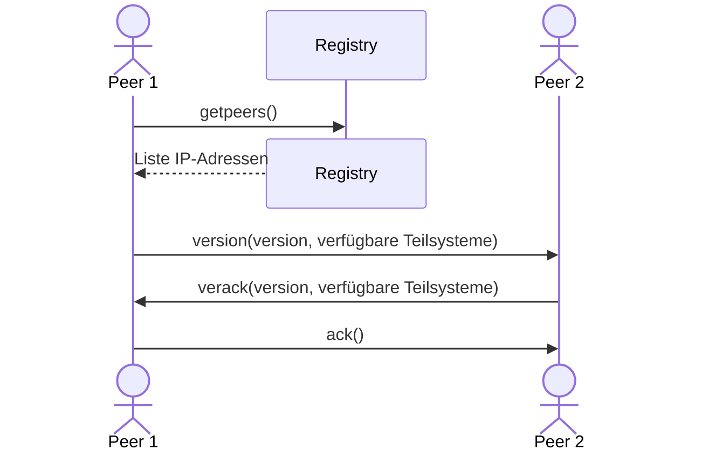

#

**Über arc42**

arc42, das Template zur Dokumentation von Software- und
Systemarchitekturen.

Template Version 9.0-DE. (basiert auf der AsciiDoc Version), Juli 2025

Created, maintained and © by Dr. Peter Hruschka, Dr. Gernot Starke and
contributors. Siehe <https://arc42.org>.

# Einführung und Ziele

Dieses Dokument beschreibt die Architektur des Peer-To-Peer (P2P)-Netzwerk für die Kryptowährung V$Goin. Im Kontext von Kryptowährungen kann dieses Netzwerk als ein öffentliches, dezentrales, Proof-of-Work orientiertes Netz eingeordnet werden. Das heißt, dass jeder Teil dieses Netzes sein kann, Transaktionen über mehrere Teilnehmer verteilt gespeichert werden und ein gewisser Rechenaufwand erforderlich ist, um die Aufgabe eines "Miners" zu erfüllen. Das Netz ist stark an existierenden Blockchains orientiert, wobei Konzepte auf grundlegendes reduziert werden.

Es gibt zwei Hauptakteure im Netzwerk: Miner und Händler. Händler sind nur an der Nutzung des Netzes orientiert. Sie geben hauptsächlich Transaktionen in Auftrag. Miner sind all die Systeme, die zur Erweiterung der Blockchain beitragen. Sie führen bestimmte kryptographische Operationen, die mit Rechenaufwand verbunden sind (Proof-of-Work), aus und ermöglichen so, dass Transaktionen getätigt werden können. Für diese Arbeit werden sie entlohnt. Sowohl Händler als auch Miner können dem Netzwerk jederzeit beitreten und verlassen.

In einem größeren Kontext wird dieses Netzwerk als verteilte Datenbank für den V$Goin genutzt und parallel mit dem System REST-API entwickelt. Die REST-API baut auf dieses Netzwerk auf und soll unseren Kunden einen benutzerfreundlicheren Zugang bieten.

## Aufgabenstellung

Das P2P-Netzwerk dient in erster Linie der Ermöglichung von Handel der Kryptowährung V$Goin in einem sicheren und dezentralen Ansatz. Die Grundanforderungen beziehen sich hauptsächlich auf die Erfüllung der Eigenschaften einer Blockchain. Besonders Erzeugung, Verteilung, Validierung und dauerhafte, unveränderliche Speicherung von Transaktionen.

Außerdem entsteht dieses System im Rahmen des Moduls "Verteilte Systeme" im Informatik Studium. Ein wichtiger Teil der Arbeit ist es daher ebenso neue Technologien (Blockchain), Architekturen (der verteilten Systeme) und Programmiersprachen (Go) kennenzulernen.

    

| Nr   | Use Case                             | Beschreibung                                                                                                                                             |
| ---- | ------------------------------------ | -------------------------------------------------------------------------------------------------------------------------------------------------------- |
| UC-1 | Währung handeln                      | Die Kryptowährung kann gehandelt werden, indem Währungsbeträge von einem Konto auf ein anderes Konto transferiert werden.                                |
| UC-2 | Kontostände lesen                    | Die Kontostände seines eigenen Kontos als auch das aller anderen Konten kann gelesen werden.                                                             |
| UC-3 | Daten verifizieren                   | Miner validieren Transaktionen und Blöcke durch kryptographische Verfahren. Händler wollen Kontostände und Transaktionen überprüfen.                     |
| UC-4 | Verbinden / Trennen aus dem Internet | Die öffentliche Blockchain soll für jeden aus dem Internet erreichbar sein. Teilnehmer treten dem P2P Netzwerk zu beliebiger Zeit bei oder verlassen es. |
| UC-5 | Blockchain synchronisieren           | Akteure gleichen ihre lokale Kopie der Blockchain mit anderen Akteuren ab, um auf dem aktuellen Stand zu bleiben.                                        |
| UC-6 | Peers finden                         | Akteure können einen Teil der vorhandenen Peers des Netzwerk entdecken und sich mit ihnen verbinden.                                                     |
| UC-7 | Block minen                          | Die Blockchain kann um kryptographisch valide Blöcke erweitert werden. Der Miner wird für den Rechenaufwand belohnt.                                     |

Vollständige Liste der Anforderungen: [GitHub Issues](https://github.com/bjoern621/VSP-Blockchain/issues?q=sort%3Aupdated-desc%20is%3Aissue%20label%3Ablockchain%20label%3AUS).

## Qualitätsziele

| Priorität | Qualitätsziel     | Motivation                                                                                                                                                                                                                                                                                                                                                |
| --------- | ----------------- | --------------------------------------------------------------------------------------------------------------------------------------------------------------------------------------------------------------------------------------------------------------------------------------------------------------------------------------------------------- |
| 1         | Understandability | Wir wollen die Konzepte von Blockchain und verteilten Systemen verstehen. Die Architektur und der Code müssen daher nachvollziehbar und gut dokumentiert sein. Es sollen Architekturmuster genutzt werden und [Go Best Practices](https://go.dev/doc/effective_go) angewandt. Dokumentation sollte kontinuierlich auf dem neuesten Stand gehalten werden. |
| 2         | Fehlertoleranz    | V$Goin ist eine Währung. Keine Beträge dürfen unbegründet entstehen oder verschwinden. Bei widersprüchlichen Daten, z. B. wenn zwei Miner gleichzeitig einen Block finden, muss stets ein gemeinsamer Konsens gefunden werden.                                                                                                                            |
| 3         | Skalierbarkeit    | Ein zentrales Ziel von verteilten Systemen ist die Skalierbarkeit der verfügbaren Ressourcen. Auf diese Ziele sollte ein besonderes Augenmerk gelegt werden. Das P2P-Netzwerk muss stabil bleiben, auch wenn bis zu 50 Akteure gleichzeitig dem Netzwerk beitreten, es verlassen oder aktiv minen.                                                        |

## Stakeholder

| Nummer | Rolle                            | Erwartungshaltung                                                                                                                                   |
| ------ | -------------------------------- | --------------------------------------------------------------------------------------------------------------------------------------------------- |
| 1      | Entwickler                       | Lernen der Technologien und Verteilte Systeme bei akzeptablem Zeitaufwand (3+1 SWS).                                                                |
| 2      | Kunde                            | Architektur nach wissenschaftlicher Praxis, Dokumentation und Code müssen zueinander passen und zugesagte Funktionalität sollte eingehalten werden. |
| 3      | Öffentliche Nutzer des Netzwerks | Klare Dokumentation wie das Netzwerk genutzt werden sollte. Netzwerk funktioniert jederzeit und ist sicher/vertrauenswürdig.                        |
| 4      | REST-API (Entwickler)            | Umsetzung der Händler-Aktivitäten ohne Miner-Aktivitäten.                                                                                           |
| 5      | ICC                              | Keine übermäßige Nutzung der Ressourcen.                                                                                                            |

    

# Randbedingungen

| Einschränkung                   | Erklärung                                                                                                                                                                                                                                                                                                                                                                                                                                                                                                                                                                                                   |
| ------------------------------- | ----------------------------------------------------------------------------------------------------------------------------------------------------------------------------------------------------------------------------------------------------------------------------------------------------------------------------------------------------------------------------------------------------------------------------------------------------------------------------------------------------------------------------------------------------------------------------------------------------------- |
| Implementierung in Go           | Im Team wurde sich auf die Programmiersprache Go geeinigt. Go wurde zum einen aus Lernzwecken gewählt, aber auch, weil die Sprache Vorteile für verteilte Systeme bietet. Die Go Binary ist beispielsweise deutlich kleiner als die eines ähnlichen Java‑Programms, weil keine JVM benötigt wird, dadurch stehen mehr Ressourcen für die Skalierung zur Verfügung. Darüber hinaus verfügt Go über eine sehr gute Dokumentation. Weitere Qualitäten sind Einfachheit, Effizienz und Skalierbarkeit, eine Reihe von [Case Studies](https://go.dev/solutions/case-studies) unterstreichen diese Eigenschaften. |
| Interne Kommunikation via RPC   | Die Kommunikation zwischen den Netzwerkknoten muss über Remote Procedure Calls (RPC) erfolgen. RPC ermöglicht schnellere Kommunikation als bspw. REST und ist somit eine gute Wahl für interne Kommunikation.                                                                                                                                                                                                                                                                                                                                                                                               |
| Loadsharing Unterstützung       | Das System muss in der Lage sein, Last zwischen mehreren Knoten zu verteilen. Das Konzept öffentliche Blockchain zielt bereits auf diese Eigenschaft ab, so dass diese Einschränkung keine weiteren Auswirkungen haben sollte.                                                                                                                                                                                                                                                                                                                                                                              |
| Service Orchestrierung über RPC | Die einzelnen Services (Miner, Händler) müssen über RPC-Aufrufe untereinander koordiniert werden. Dies könnte z. B. Timeouts, Retries, ausführliches Logging und konsistente Fehlerbehandlung über Service-Grenzen hinweg erfordern.                                                                                                                                                                                                                                                                                                                                                                        |
| Lauffähig in ICC                | Das System muss in der ICC gehostet werden. Das System muss dort deployed und getestet werden.                                                                                                                                                                                                                                                                                                                                                                                                                                                                                                              |
| Lauffähig in Raum 7.65          | Die Computer im Raum 7.65 sind die Referenzsysteme für die Abnahme. Das System muss dort getestet werden.                                                                                                                                                                                                                                                                                                                                                                                                                                                                                                   |
| ICC Ressourcen                  | Die Ressourcen der ICC sind begrenzt, siehe [Ressourcenquoten](https://doc.inf.haw-hamburg.de/Dienste/icc/resourcequotas/). Dies begrenzt uns z. B. bei der Skalierbarkeit.                                                                                                                                                                                                                                                                                                                                                                                                                                 |
| Zeit                            | Der zeitliche Rahmen umfasst 15 Wochen, von 15.10.2025 bis 27.01.2026. An diesem Projekt wird nicht Vollzeit gearbeitet, Aufwand nach Modulplan ist 3+1 SWS. Der Featureumfang sollte entsprechend klein gewählt werden.                                                                                                                                                                                                                                                                                                                                                                                    |
| Budget                          | Die Überwindungskosten Geld auszugeben sind sehr hoch. Es ist wahrscheinlicher, dass Features entfallen als dass zusätzliches Geld ausgegeben wird.                                                                                                                                                                                                                                                                                                                                                                                                                                                         |
| Dokumentationspflicht           | Eine ausführliche, vollständige und zum System passende Dokumentation ist explizit gewünscht. Dies könnte sich negativ auf das Zeitkontingent auswirken.                                                                                                                                                                                                                                                                                                                                                                                                                                                    |

# Kontextabgrenzung

## Fachlicher & Technischer Kontext

Der Kontext des Systems ist sehr begrenzt, weswegen fachlicher und technischer Kontext zusammengefasst wurden.

    

| Nachbar          | Beschreibung                                                                                                                                                                                                                 | Input                                                                                                                            | Output                                                                                                     |
| ---------------- | ---------------------------------------------------------------------------------------------------------------------------------------------------------------------------------------------------------------------------- | -------------------------------------------------------------------------------------------------------------------------------- | ---------------------------------------------------------------------------------------------------------- |
| Externer Miner   | Ein P2P-Netzwerkknoten, der von einer dritten Person betrieben wird, ggf. über das Internet verbunden ist und am Mining beteiligt ist. Dieser Knoten kann ggf. eine alternative Implementierung verwenden.                   | Blockchain-Blöcke \[[UC-7](#aufgabenstellung)\], Statusnachrichten (Join/Leave) \[[UC-4](#aufgabenstellung)\] via gRPC/Internet  | Blockchain \[[UC-5, 3](#aufgabenstellung)\], Peer-Liste \[[UC-6](#aufgabenstellung)\] via gRPC/Internet    |
| Externer Händler | Ein P2P-Netzwerkknoten, der von einer dritten Person betrieben wird, ggf. über das Internet verbunden ist und am Handel der Kryptowährung beteiligt ist. Dieser Knoten kann ggf. eine alternative Implementierung verwenden. | Neue Transaktionen \[[UC-1](#aufgabenstellung)\], Statusnachrichten (Join/Leave) \[[UC-4](#aufgabenstellung)\] via gRPC/Internet | Blockchain \[[UC-5, 2, 3](#aufgabenstellung)\], Peer-Liste \[[UC-6](#aufgabenstellung)\] via gRPC/Internet |
| REST-API         | Technisch gesehen ein Externer Händler. Fachlich hat unser System jedoch eine Sonderstellung, weil es als von uns betriebene API eng mit Netzwerk zusammen entwickelt wird.                                                  | Siehe Externer Händler; via gRPC                                                                                                 | Siehe Externer Händler; via gRPC                                                                           |

Ein Nachbar kann natürlich auch externer Miner und externer Händler zugleich sein.

# Lösungsstrategie

Beispiele:
Entwurfsentscheidungen und Lösungsstrategien Gesamtarchitektur
Technologieentscheidungen, Top-Level-Zerlegungsstrategie, Ansätze Erreichung Qualitätsziele,
Organisationsentscheidungen
TODO entfernern

-   geschrieben in Go, den [Go Best Practices](https://go.dev/doc/effective_go) folgend, trägt u. a. zum Erreichen der [Understandability](#qualitätsziele) bei
-   klare, unveränderliche Builds um stets einen gemeinsamen, testbaren Stand zu haben
-   explizites Review der Dokumentation für jedes einzelne Issue-Ticket um der Dokumentationspflicht (siehe [Randbedingungen](#randbedingungen) und [Stakeholder](#stakeholder)) gerecht zu werden
-   das System besteht aus einer Registry, die für das initiale Verbinden zu Peers zuständig ist und dem P2P-Netzwerk selbst, das alles andere erledigt
-   jede Node besteht aus einer Kombination der vier Teilsysteme Wallet, Miner, Blockchain und Netzwerkrouting, so wird Modularität gesichert (siehe [REST-API (Entwickler) Stakeholder](#stakeholder))

# Bausteinsicht

## Whitebox Gesamtsystem

    
    
<em>Abbildung: Layer 1 - Whitebox Gesamtsystem</em>

Begründung  
Das Diagramm zeigt die oberste Sicht auf das System. Es dient als Überblick über die zwei Hauptkomponenten des Systems. Die Registry ist dabei nur ein kleineres System, das immer über die gleiche Methode erreichbar ist und von neuen Peers benötigt wird, um die eigentliche Verbindung zu dem dynamischen P2P Netzwerk herzustellen. Der Großteil der Logik und der Komplexität findet im P2P Netzwerk statt. Die Größe dieser beiden Komponenten ist also sehr ungleich verteilt, dies sollte beachtet werden.

Wichtig hier ist auch die Unterscheidung zwischen **internen** Peers (hier innerhalb der P2P Netzwerk Komponente) und **externen** Peers (hier als externer Händler / externer Miner bezeichnet). Es soll verdeutlicht werden, dass das verteilte System offen für dritte Netzwerkknoten ist.

### Registry (Blackbox)

Zweck/Verantwortung  
Ermöglicht die initiale Verbindung zum P2P Netzwerk, wenn noch kein Peer bekannt ist. Konzeptionell hat die Registry nur genau zwei wichtige Eigenschaften: 1. Hält eine modifizierbare Liste von IP Adress Einträgen und 2. ist über eine statische Methode erreichbar. Beide Eigenschaften können über ein DNS System realisiert werden in dem mehrere A/AAAA Einträge einer Domain erstellt bzw. modifiziert werden.

Schnittstellen

-   `getpeers` liefert die aktuelle Liste von IP Adressen von aktiven Nodes im P2P Netzwerk, zu denen eine Verbindung aufgebaut werden kann. Die Einträge liefern nur IP Adressen und keinen expliziten Port. Für den [Verbindungsaufbau](https://github.com/bjoern621/VSP-Blockchain/issues/83) wird daher stets der Standardport verwendet.
-   `updatepeers` modifiziert die oben erwähnte Liste von IP Adressen. Wird regelmäßig vom Registry Crawler (siehe [Ebene 2](#ebene-2)) aktualisiert um stets eine aktuelle Liste von aktiven Peers zu haben.

Siehe auch [Schnittstellen P2P Netzwerk Wiki](https://github.com/bjoern621/VSP-Blockchain/wiki/Externe-Schnittstelle-Mining-Network) für eine genauere Beschreibung der Schnittstellen.

Qualitäts-/Leistungsmerkmale

-   Distribution Transparency  
    Die Registry trägt maßgeblich zur Verteilungstransparenz (genauer Zugriffstransparenz) des verteilten Systems bei in dem es eine einzige und sich nicht ändernde Möglichkeit bietet, sich zum Netzwerk zu verbinden. Nutzer des verteilten Systems (z. B. Nodes) müssen nicht explizit andere Nodes im System kennen, um mit dem System initial zu interagieren. Die Nodes brauchen durch die Registry auch kein Wissen über die genaue Anzahl oder deren physischen Standort (IP).

Erfüllte Anforderungen  
Trägt zur Erfüllung dieser Anforderungen bei:

-   [US-72 Peer-Liste abrufen](https://github.com/bjoern621/VSP-Blockchain/issues/72)
-   [US-82 Peer-Liste aktualisieren](https://github.com/bjoern621/VSP-Blockchain/issues/82)
-   [US-83 Verbindungsaufbau](https://github.com/bjoern621/VSP-Blockchain/issues/83) (indirekt, da Registry eine Voraussetzung für den Verbindungsaufbau ist)

Offene Punkte/Probleme/Risiken  
Wir haben bereits die Domain `vsgoin.informatik.haw-hamburg.de` aber es ist noch unklar, ob wir dort die DNS Einträge frei ändern können, da sie von der ICC verwaltet wird. Dieses Problem kann mit einer eigenen Domain umgangen werden. Außerdem hat die ICC möglicherweise nur eine externe IP und die einzelnen Nodes innerhalb des ICC Clusters (für Nodes siehe auch [Ebene 2](#ebene-2)) können möglicherweise nicht direkt angesteuert werden. Diese Probleme sollten noch getestet werden und Lösungen gefunden (getrackt in [Task-91](https://github.com/bjoern621/VSP-Blockchain/issues/91)).

### P2P Netzwerk (Blackbox)

Zweck/Verantwortung  
Gesamtheit aller **internen** Peers, die über das V$Goin P2P Protocol kommunizieren. Intern meint hier innerhalb der ICC laufend. Die Komponente enthält die Peers, die zusammen das P2P Netzwerk bilden. Eine genauere Beschreibung des P2P Netzwerk wird in [Ebene 2](#ebene-2) gegeben (Hinweis: Dort wird **keine** Unterscheidung mehr zwischen intern / extern gemacht).

Schnittstellen

-   `P2P Nachrichten` steht stellvertretend für alle Nachrichten des P2P Protokolls. Diese Nachrichten werden sowohl zwischen internen und externen Peers ausgetauscht als auch zwischen internen und internen und externen und externen. Daher macht eine Unterscheidung zwischen intern / extern hier wenig Sinn und die Nachrichten werden genauer in [Ebene 2](#ebene-2) beschrieben.

Siehe auch [Schnittstellen P2P Netzwerk Wiki](https://github.com/bjoern621/VSP-Blockchain/wiki/Externe-Schnittstelle-Mining-Network) für eine genauere Beschreibung der Schnittstellen.

### getpeers (Schnittstelle)

Siehe Schnittstellenbeschreibung für getpeers weiter oben. Die getpeers Schnittstelle ist sowohl für interne Peers des Netzwerks (in der oberen Abbildung dargestellt als P2P Netzwerk) als auch für externe Händler / Miner gedacht.

### P2P Nachrichten (Schnittstelle)

P2P Nachrichten meint alle Nachrichten des V$Goin P2P Protokolls. Eine Übersicht hierfür bietet [Schnittstellen P2P Netzwerk Wiki](https://github.com/bjoern621/VSP-Blockchain/wiki/Externe-Schnittstelle-Mining-Network). Die Nachrichten des Protokolls werden sowohl _an_ als auch _von_ internen Nodes geschickt. Eine deutlich genauere Beschreibung der P2P Nachrichten wird in [Ebene 2](#ebene-2) gemacht. Wichtig ist, dass diese Schnittstelle exakt dieselbe ist, wie die zwischen den internen Peers.

## Ebene 2

### Whitebox P2P Netzwerk

    
    
<em>Abbildung: Layer 2 - Whitebox P2P Netzwerk</em>

Begründung  
Diese Ebene soll einen Überblick über die verschiedenen Akteure des Netzwerks bieten. Das Netzwerk besteht aus mehreren Peers, die miteinander in einem teilvermaschten Netz verbunden sind. Es können theoretisch beliebig viele Nodes Teil des Netzes sein.

Die Arten der Nodes (SPV vs. Miner Node) unterscheiden sich in den enthaltenen Teilsystemen. Nodes müssen nicht auf diese beiden Arten begrenzt sein, Teilsysteme können (fast) beliebig kombiniert werden. So könnte z. B. eine _Full Node_ eine Kombination aus SPV und Miner Node sein. Mehr zu Teilsystemen in [Ebene 3](#ebene-3). Der Registry Crawler ist ebenfalls eine Node bestehend aus Teilsystemen.

Hinweis: Die externen Schnittstellen zu Externer Miner / Händler und REST API wurden hier weggelassen. Die externen Nodes verhalten sich zu den internen Nodes in jedem relevanten Aspekt gleich. Die externen Nodes und internen Nodes sind hier allgemein als Node bezeichnet.

### Registry Crawler (Blackbox)

Zweck/Verantwortung  
Besondere Node im Netzwerk, die ständig die Registry aktualisiert. Sie hat nur ein Teilsystem, das Netzwerkrouting. Die grundsätzliche Funktionsweise ist, dass der Crawler regelmäßig Verbindungen zu verschiedenen Nodes herstellt (über [version, verack und ack](https://github.com/bjoern621/VSP-Blockchain/wiki/Externe-Schnittstelle-Mining-Network)) und daraufhin die Nachbarn dieses Netzwerkknotens abfragt (über [getaddr](https://github.com/bjoern621/VSP-Blockchain/wiki/Externe-Schnittstelle-Mining-Network)). Durch Wiederholen dieses Prozesses wird das Netzwerk erkundet und so eine Liste aktiver Peers gepflegt.

Schnittstellen

-   `updatepeers` Der Crawler gibt die Änderung über [updatepeers](https://github.com/bjoern621/VSP-Blockchain/wiki/Externe-Schnittstelle-Mining-Network) frei. Dabei ist hervorzuheben, dass eigentlich nie eine vollständige Liste aller verfügbaren Peers übergeben wird, sondern stets nur ein Teil des Netzes. Dieser Ausschnitt wird durch den Crawler ebenfalls von Zeit zu Zeit rotiert. So wird vermieden, dass ein Knoten sehr viele Verbindungsanfragen bekommt und stattdessen die Last zwischen den Peers möglichst gleichmäßig verteilt werden.
-   `P2P Nachrichten` Siehe unten [Node (Blackbox)](#node-blackbox).

Qualitäts-/Leistungsmerkmale

-   Skalierbarkeit  
    Das dynamische Anpassen der Registry Liste durch den Registry Crawler ermöglicht eine deutlich bessere Skalierbarkeit als bspw. eine statische Liste von IP Adressen. Neue Peers werden so gleichmäßig auf vorhandene Peers aufgeteilt und ein zentraler Knoten mit vielen Verbindungen, der zum Bottleneck werden könnte, wird vermieden.
-   Resource Sharing  
    Auch werden so die Rechenressourcen eines bestimmten Knotens nicht zu sehr überlastet, sondern die Ressourcen aller verfügbaren Peers genutzt.
-   Resilience  
    Auch führt die Verteilung zu einem widerstandsfähigeren System. Sollte ein Peer oder auch eine Gruppe von Peers unerwartet ausfallen, sorgt die gleichmäßige Verteilung für genügend alternative Verbindung. Dies wäre unter Umständen nicht der Fall, wenn ein zentraler Peer mit sehr vielen Verbindungen, ähnlich dem zentralen Knoten einer Sterntopologie, ausfällt.

Erfüllte Anforderungen  
Trägt zur Erfüllung dieser Anforderungen bei:

-   [US-82 Peer-Liste aktualisieren](https://github.com/bjoern621/VSP-Blockchain/issues/82)

### SPV Node (Blackbox)

Zweck/Verantwortung  
Eine leichtgewichtige Node, die auf Händleraktivitäten spezialisiert ist. Enthält die Teilsystene Netzwerkrouting und Wallet.

Schnittstellen

-   `P2P Nachrichten` Siehe unten [Node (Blackbox)](#node-blackbox). Sowie die Nachrichten für das [Wallet Teilsystem](#ebene-3).

### Miner Node (Blackbox)

Zweck/Verantwortung  
Ein Node, die auf das Mining von Blöcken konzentriert ist. Enthält die Teilsysteme Netzwerkrouting, Blockchain und Miner.

Schnittstellen

-   `P2P Nachrichten` Siehe unten [Node (Blackbox)](#node-blackbox). Sowie die Nachrichten für das [Blockchain](#ebene-3) und [Miner Teilsystem](#ebene-3).

### Node (Blackbox)

Zweck/Verantwortung  
Jeder Peer im P2P Netzwerk ist eine Netzwerknode. Die einzige Voraussetzung ist, dass der Peer das grundlegende P2P Protokoll sprechen muss und somit das Teilsystem Netzwerkrouting haben muss. Mit anderen Worten: Jede Node hat immer das Netzwerkrouting Teilsystem (Teilsysteme: [Ebene 3](#ebene-3)).

Schnittstellen

-   `P2P Nachrichten` Es gibt eine ganze Reihe von Nachrichten im V$Goin P2P Protokoll. Manche Nachrichten werden nur von bestimmten Teilsystemen unterstützt, andere (viele) Nachrichten werden von dem Netzwerkrouting Teilsystem, und damit von jedem Peer, unterstützt. Hier soll nur ein Überblick über die wichtigsten (nicht vollständig!) Netzwerkrouting Nachrichten gegeben werden:

    | Kategorie         | Nachrichten          | Beschreibung                                                                                                                                                                                                   |
    | ----------------- | -------------------- | -------------------------------------------------------------------------------------------------------------------------------------------------------------------------------------------------------------- |
    | Verbindungsaufbau | version, verack, ack | Ein Drei-Wege-Handshake, der zusätzlich verfügbare Teilsysteme austauscht. Dies sind die ersten Nachrichten des P2P Protokolls. (getpeers wird kurz vorher aufgerufen, ist aber nicht Teil des P2P Protokolls) |
    | Peer Discovery    | getaddr, addr        | Diese Nachrichten sorgen für stets aktuelle Peers und genügend Alternativrouten, falls ein Peer das Netzwerk verlässt.                                                                                         |
    | Keepalive         | heartbeat            | Eng verbunden mit den Peer Discovery Nachrichten. Ein Heartbeat wird in regelmäßigen Abständen an direkte Nachbarn gesendet, um inaktive Verbindungen zu erkennen.                                             |
    | Error Handling    | reject               | Nachrichten, die sich um Error Handling bemühen. Wirkt sich direkt auf die Fehlertransparenz (Distribution Transparency) aus.                                                                                  |

Erfüllte Anforderungen  
Trägt zur Erfüllung dieser Anforderungen bei:

-   [US-81 Periodisches Überprüfen der Verbindungen](https://github.com/bjoern621/VSP-Blockchain/issues/81)
-   [US-76 Heartbeat-Nachrichten](https://github.com/bjoern621/VSP-Blockchain/issues/76)
-   [US-93 Reject Nachrichten](https://github.com/bjoern621/VSP-Blockchain/issues/93)
-   [US-83 Verbindungsaufbau](https://github.com/bjoern621/VSP-Blockchain/issues/83)
-   viele weitere

### updatepeers (Schnittstelle)

Wird von dem Registry Crawler regelmäßig aufgerufen, um die Liste der aktuell verfügbaren Peers zu aktualisieren. Wird durch die Registry bereitgestellt. Mehr zu dieser Schnittstelle in der [Registry (Blackbox)](#registry-blackbox) und [Registry Crawler (Blackbox)](#registry-crawler-blackbox) Beschreibung.

### getpeers (Schnittstelle)

Die Peers benötigen vor dem Verbindungsaufbau mindestens einen Peer, zu dem sie sich verbinden können. Die getpeers Schnittstelle ist die erste Funktion die aufgerufen wird, wenn sich ein neuer Peer mit dem Netzwerk verbinden will. Sie wird zur Laufzeit einer Node grundsätzlich nur einmal aufgerufen. Solange ein Netzwerkknoten mindestens eine aktive P2P Verbindung hat, wird nicht mit der Registry kommuniziert, sondern über diesen anderen Knoten mögliche Verbindungen bestimmt ([getaddr](https://github.com/bjoern621/VSP-Blockchain/wiki/Externe-Schnittstelle-Mining-Network)). Wird durch die Registry bereitgestellt. Mehr zu dieser Schnittstelle in der [Registry (Blackbox)](#registry-blackbox) Beschreibung.

## Ebene 3

### Whitebox Full Node

    
    
<em>Abbildung: Layer 3 - Whitebox Full Node</em>

Begründung  
Diese Aufteilung zeigt die oberste Sicht auf eine einzelne Node. Der Fokus liegt auf den vier Teilsystemen und deren Kommunikation untereinander.

Dargestellt ist nur eine Full Node, die Teilsysteme können aber, mit Beachtung der Abhängigkeiten beliebig kombiniert werden. Eine SPV Node würde zum Beispiel keine Miner Komponente haben. Ein Miner kann auch ohne Wallet agieren.

### Blockchain (Blackbox)

Zweck/Verantwortung  
Das Teilsystem Blockchain stellt die lokale Sicht auf die globale Kette bereit. Es gibt zwei mögliche Implementierungen für das Blockchain Teilsystem. 1. Vereinfachte Blockchain und 2. Vollständige Blockchain.

Die vereinfachte Blockchain speichert hauptsächlich Block‑Header und ausgewählte Transaktionen und verlässt sich stärker auf andere Full Nodes, um Gültigkeit von Transaktionen und Blöcken zu prüfen. Sie kommuniziert bei Bedarf mit benachbarten Nodes, um an Informationen zu gelanden. Dadurch werden Speicher‑ und Rechenressourcen gespart, allerdings auf Kosten von Sicherheit. Die vollständige Blockchain speichert alle Blöcke (und Transaktionen und UTXO‑Set und Mempool) und validiert jede Transaktion und jeden Block lokal. Sie benötigt deutlich mehr Ressourcen, bietet dafür aber mehr Sicherheit.

Ob eine Node die vereinfachte oder vollständige Variante wählt ist zunächst egal. Jedoch verwenden SPV Nodes tendenziell die vereinfachte Blockchain, um Ressourcen zu sparen und Miner Nodes nutzen die vollständige Blockchain Implementierung, um möglichst schnell und unabhängig von anderen Nodes Blöcke validieren zu können.

Schnittstellen

-   `Nachrichten senden / empfangen` muss die Blockchain Komponente über das Netzwerkrouting, weil nur das Netzwerkrouting die benachbarten Peers kennt und mit diesen kommunizieren kann. Um über neue Nachrichten benachrichtigt zu werden, kann das Observer Pattern genutzt werden. So wird auch die Abhängigkeit von Netzwerkrouting zu Blockchain vermieden.

Erfüllte Anforderungen  
Trägt zur Erfüllung dieser Anforderungen bei:

-   [Meilenstein Blockchain (GitHub Issues)](<https://github.com/bjoern621/VSP-Blockchain/issues?q=sort%3Aupdated-desc%20is%3Aissue%20label%3Ablockchain%20label%3AUS%20milestone%3A%22Blockchain%20(Teilsystem)%22>)

Offene Punkte/Probleme/Risiken  
Die detaillierte Unterschiedung zwischen vereinfacht und vollständig ist noch recht schwer. Vorallem welche Bestandteile der Blockchain Wallet oder Miner brauchen / nicht brauchen ist schwer zu überblicken. Hier sollte ggf. später spezifiziert werden.

### Wallet (Blackbox)

### Miner (Blackbox)

### Netzwerkrouting (Blackbox)

## Ebene 4

### Whitebox Teilsystem

Begründung  
Diese Aufteilung fokussiert sich auf die Schichtenarchitektur innerhalb eines Teilsystems. Jedes Teilsystem ist in die drei Layer Interface, Business, Data geteilt. Der Interface Layer bildet die Schnittstelle des Teilsystems und interagiert mit anderen Teilsystemen / Komponenten des Systems. Der Business Layer enthält die Kern-Logik des Systems und der Data Layer ist für die Speicherung und das Laden von Daten verantwortlich. Siehe auch Van Steen, M. R. (2017). Distributed systems., S. 60-62 für eine genauere Beschreibung.

Offene Punkte/Probleme/Risiken  
Architektur ist Subjekt To Change, aber Vorgabe ist mMn, dass mindestens MVC genutzt wird.

### Whitebox Blockchain

Begründung  
Der Fokus dieser Teilung ist die Unterscheidung zwischen vereinfachter Blockchain und vollständiger Blockchain zu veranschaulichen.

Offene Punkte/Probleme/Risiken  
Vllt. ist diese Anschauung auch unnötig? (Weil vllt. die gleichen Komponenten enthalten sind?)

# Laufzeitsicht

## _\<Bezeichnung Laufzeitszenario 1\>_

-   \<hier Besonderheiten bei dem Zusammenspiel der Bausteine in diesem
    Szenario erläutern\>

## _\<Bezeichnung Laufzeitszenario 2\>_

…​

## _\<Bezeichnung Laufzeitszenario n\>_

…​

# Verteilungssicht

## Infrastruktur Ebene 1

**_\<Übersichtsdiagramm\>_**

Begründung  
_\<Erläuternder Text\>_

Qualitäts- und/oder Leistungsmerkmale  
_\<Erläuternder Text\>_

Zuordnung von Bausteinen zu Infrastruktur  
_\<Beschreibung der Zuordnung\>_

## Infrastruktur Ebene 2

### _\<Infrastrukturelement 1\>_

_\<Diagramm + Erläuterungen\>_

### _\<Infrastrukturelement 2\>_

_\<Diagramm + Erläuterungen\>_

…​

### _\<Infrastrukturelement n\>_

_\<Diagramm + Erläuterungen\>_

# Querschnittliche Konzepte

## _\<Konzept 1\>_

_\<Erklärung\>_

## _\<Konzept 2\>_

_\<Erklärung\>_

…​

## _\<Konzept n\>_

_\<Erklärung\>_

# Architekturentscheidungen

# Qualitätsanforderungen

## Übersicht der Qualitätsanforderungen

## Qualitätsszenarien

# Risiken und technische Schulden

# Glossar

| Begriff      | Definition                                                                     |
| ------------ | ------------------------------------------------------------------------------ |
| SPV          | Simplified Payment Verification                                                |
| SPV Node     | Auch _Händler_, hat Teilsysteme: Wallet, Netzwerk-Routing                      |
| Miner (Node) | Hat Teilsysteme: Blockchain, Miner, Netzwerk-Routing, auch _Solo-Miner_        |
| ICC          | Informatik Compute Cloud, Cloud-Plattform vom Rechenzentrum der Informatik HAW |
| Node         | Ein eigenständiges System, das Teil des P2P Netzwerks ist. Synonym für Peer.   |
