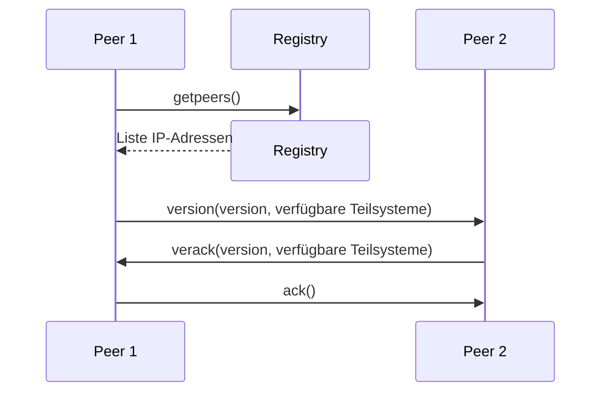

#

**Über arc42**

arc42, das Template zur Dokumentation von Software- und
Systemarchitekturen.

Template Version 9.0-DE. (basiert auf der AsciiDoc Version), Juli 2025

Created, maintained and © by Dr. Peter Hruschka, Dr. Gernot Starke and
contributors. Siehe <https://arc42.org>.

# Einführung und Ziele

Dieses Dokument beschreibt die Architektur des Peer-To-Peer (P2P)-Netzwerk für die Kryptowährung V$Goin. Im Kontext von Kryptowährungen kann dieses Netzwerk als ein öffentliches, dezentrales, Proof-of-Work orientiertes Netz eingeordnet werden. Das heißt, dass jeder Teil dieses Netzes sein kann, Transaktionen über mehrere Teilnehmer verteilt gespeichert werden und ein gewisser Rechenaufwand erforderlich ist, um die Aufgabe eines "Miners" zu erfüllen. Das Netz ist stark an existierenden Blockchains orientiert, wobei Konzepte auf grundlegendes reduziert werden.

Es gibt zwei Hauptakteure im Netzwerk: Miner und Händler. Händler sind nur an der Nutzung des Netzes orientiert. Sie geben hauptsächlich Transaktionen in Auftrag. Miner sind all die Systeme, die zur Erweiterung der Blockchain beitragen. Sie führen bestimmte kryptographische Operationen, die mit Rechenaufwand verbunden sind (Proof-of-Work), aus und ermöglichen so, dass Transaktionen getätigt werden können. Für diese Arbeit werden sie entlohnt. Sowohl Händler als auch Miner können dem Netzwerk jederzeit beitreten und verlassen.

In einem größeren Kontext wird dieses Netzwerk als verteilte Datenbank für den V$Goin genutzt und parallel mit dem System REST-API entwickelt. Die REST-API baut auf dieses Netzwerk auf und soll unseren Kunden einen benutzerfreundlicheren Zugang bieten.

## Aufgabenstellung

Das P2P-Netzwerk dient in erster Linie der Ermöglichung von Handel der Kryptowährung V$Goin in einem sicheren und dezentralen Ansatz. Die Grundanforderungen beziehen sich hauptsächlich auf die Erfüllung der Eigenschaften einer Blockchain. Besonders Erzeugung, Verteilung, Validierung und dauerhafte, unveränderliche Speicherung von Transaktionen.

Außerdem entsteht dieses System im Rahmen des Moduls "Verteilte Systeme" im Informatik Studium. Ein wichtiger Teil der Arbeit ist es daher ebenso neue Technologien (Blockchain), Architekturen (der verteilten Systeme) und Programmiersprachen (Go) kennenzulernen.

<div align="center">
    
</div>

| Nr   | Use Case                             | Beschreibung                                                                                                                                             |
| ---- | ------------------------------------ | -------------------------------------------------------------------------------------------------------------------------------------------------------- |
| UC-1 | Währung handeln                      | Die Kryptowährung kann gehandelt werden, indem Währungsbeträge von einem Konto auf ein anderes Konto transferiert werden.                                |
| UC-2 | Kontostände lesen                    | Die Kontostände seines eigenen Kontos als auch das aller anderen Konten kann gelesen werden.                                                             |
| UC-3 | Daten verifizieren                   | Miner validieren Transaktionen und Blöcke durch kryptographische Verfahren. Händler wollen Kontostände und Transaktionen überprüfen.                     |
| UC-4 | Verbinden / Trennen aus dem Internet | Die öffentliche Blockchain soll für jeden aus dem Internet erreichbar sein. Teilnehmer treten dem P2P Netzwerk zu beliebiger Zeit bei oder verlassen es. |
| UC-5 | Blockchain synchronisieren           | Akteure gleichen ihre lokale Kopie der Blockchain mit anderen Akteuren ab, um auf dem aktuellen Stand zu bleiben.                                        |
| UC-6 | Peers finden                         | Akteure können einen Teil der vorhandenen Peers des Netzwerk entdecken und sich mit ihnen verbinden.                                                     |
| UC-7 | Block minen                          | Die Blockchain kann um kryptographisch valide Blöcke erweitert werden. Der Miner wird für den Rechenaufwand belohnt.                                     |

Vollständige Liste der Anforderungen: [GitHub Issues](https://github.com/bjoern621/VSP-Blockchain/issues?q=sort%3Aupdated-desc%20is%3Aissue%20label%3Ablockchain%20label%3AUS).

## Qualitätsziele

| Priorität | Qualitätsziel     | Motivation                                                                                                                                                                                                                                                                                                                                                |
| --------- | ----------------- | --------------------------------------------------------------------------------------------------------------------------------------------------------------------------------------------------------------------------------------------------------------------------------------------------------------------------------------------------------- |
| 1         | Understandability | Wir wollen die Konzepte von Blockchain und verteilten Systemen verstehen. Die Architektur und der Code müssen daher nachvollziehbar und gut dokumentiert sein. Es sollen Architekturmuster genutzt werden und [Go Best Practices](https://go.dev/doc/effective_go) angewandt. Dokumentation sollte kontinuierlich auf dem neuesten Stand gehalten werden. |
| 2         | Fehlertoleranz    | V$Goin ist eine Währung. Keine Beträge dürfen unbegründet entstehen oder verschwinden. Bei widersprüchlichen Daten, z. B. wenn zwei Miner gleichzeitig einen Block finden, muss stets ein gemeinsamer Konsens gefunden werden.                                                                                                                            |
| 3         | Skalierbarkeit    | Ein zentrales Ziel von verteilten Systemen ist die Skalierbarkeit der verfügbaren Ressourcen. Auf diese Ziele sollte ein besonderes Augenmerk gelegt werden. Das P2P-Netzwerk muss stabil bleiben, auch wenn bis zu 50 Akteure gleichzeitig dem Netzwerk beitreten, es verlassen oder aktiv minen.                                                        |

## Stakeholder

| Nummer | Rolle                            | Erwartungshaltung                                                                                                                                   |
| ------ | -------------------------------- | --------------------------------------------------------------------------------------------------------------------------------------------------- |
| 1      | Entwickler                       | Lernen der Technologien und Verteilte Systeme bei akzeptablem Zeitaufwand (3+1 SWS).                                                                |
| 2      | Kunde                            | Architektur nach wissenschaftlicher Praxis, Dokumentation und Code müssen zueinander passen und zugesagte Funktionalität sollte eingehalten werden. |
| 3      | Öffentliche Nutzer des Netzwerks | Klare Dokumentation wie das Netzwerk genutzt werden sollte. Netzwerk funktioniert jederzeit und ist sicher/vertrauenswürdig.                        |
| 4      | REST-API (Entwickler)            | Umsetzung der Händler-Aktivitäten ohne Miner-Aktivitäten.                                                                                           |
| 5      | ICC                              | Keine übermäßige Nutzung der Ressourcen.                                                                                                            |

<div align="center">
    
</div>

# Randbedingungen

| Einschränkung                   | Erklärung                                                                                                                                                                                                                                                                                                                                                                                                                                                                                                                                                                                                   |
| ------------------------------- | ----------------------------------------------------------------------------------------------------------------------------------------------------------------------------------------------------------------------------------------------------------------------------------------------------------------------------------------------------------------------------------------------------------------------------------------------------------------------------------------------------------------------------------------------------------------------------------------------------------- |
| Implementierung in Go           | Im Team wurde sich auf die Programmiersprache Go geeinigt. Go wurde zum einen aus Lernzwecken gewählt, aber auch, weil die Sprache Vorteile für verteilte Systeme bietet. Die Go Binary ist beispielsweise deutlich kleiner als die eines ähnlichen Java‑Programms, weil keine JVM benötigt wird, dadurch stehen mehr Ressourcen für die Skalierung zur Verfügung. Darüber hinaus verfügt Go über eine sehr gute Dokumentation. Weitere Qualitäten sind Einfachheit, Effizienz und Skalierbarkeit, eine Reihe von [Case Studies](https://go.dev/solutions/case-studies) unterstreichen diese Eigenschaften. |
| Interne Kommunikation via RPC   | Die Kommunikation zwischen den Netzwerkknoten muss über Remote Procedure Calls (RPC) erfolgen. RPC ermöglicht schnellere Kommunikation als bspw. REST und ist somit eine gute Wahl für interne Kommunikation.                                                                                                                                                                                                                                                                                                                                                                                               |
| Loadsharing Unterstützung       | Das System muss in der Lage sein, Last zwischen mehreren Knoten zu verteilen. Das Konzept öffentliche Blockchain zielt bereits auf diese Eigenschaft ab, so dass diese Einschränkung keine weiteren Auswirkungen haben sollte.                                                                                                                                                                                                                                                                                                                                                                              |
| Service Orchestrierung über RPC | Die einzelnen Services (Miner, Händler) müssen über RPC-Aufrufe untereinander koordiniert werden. Dies könnte z. B. Timeouts, Retries, ausführliches Logging und konsistente Fehlerbehandlung über Service-Grenzen hinweg erfordern.                                                                                                                                                                                                                                                                                                                                                                        |
| Lauffähig in ICC                | Das System muss in der ICC gehostet werden. Das System muss dort deployed und getestet werden.                                                                                                                                                                                                                                                                                                                                                                                                                                                                                                              |
| Lauffähig in Raum 7.65          | Die Computer im Raum 7.65 sind die Referenzsysteme für die Abnahme. Das System muss dort getestet werden.                                                                                                                                                                                                                                                                                                                                                                                                                                                                                                   |
| ICC Ressourcen                  | Die Ressourcen der ICC sind begrenzt, siehe [Ressourcenquoten](https://doc.inf.haw-hamburg.de/Dienste/icc/resourcequotas/). Dies begrenzt uns z. B. bei der Skalierbarkeit.                                                                                                                                                                                                                                                                                                                                                                                                                                 |
| Zeit                            | Der zeitliche Rahmen umfasst 15 Wochen, von 15.10.2025 bis 27.01.2026. An diesem Projekt wird nicht Vollzeit gearbeitet, Aufwand nach Modulplan ist 3+1 SWS. Der Featureumfang sollte entsprechend klein gewählt werden.                                                                                                                                                                                                                                                                                                                                                                                    |
| Budget                          | Die Überwindungskosten Geld auszugeben sind sehr hoch. Es ist wahrscheinlicher, dass Features entfallen als dass zusätzliches Geld ausgegeben wird.                                                                                                                                                                                                                                                                                                                                                                                                                                                         |
| Dokumentationspflicht           | Eine ausführliche, vollständige und zum System passende Dokumentation ist explizit gewünscht. Dies könnte sich negativ auf das Zeitkontingent auswirken.                                                                                                                                                                                                                                                                                                                                                                                                                                                    |

# Kontextabgrenzung

## Fachlicher & Technischer Kontext

Der Kontext des Systems ist sehr begrenzt, weswegen fachlicher und technischer Kontext zusammengefasst wurden.

<div align="center">
    
</div>

| Nachbar          | Beschreibung                                                                                                                                                                                                                 | Input                                                                                                                            | Output                                                                                                     |
| ---------------- | ---------------------------------------------------------------------------------------------------------------------------------------------------------------------------------------------------------------------------- | -------------------------------------------------------------------------------------------------------------------------------- | ---------------------------------------------------------------------------------------------------------- |
| Externer Miner   | Ein P2P-Netzwerkknoten, der von einer dritten Person betrieben wird, ggf. über das Internet verbunden ist und am Mining beteiligt ist. Dieser Knoten kann ggf. eine alternative Implementierung verwenden.                   | Blockchain-Blöcke \[[UC-7](#aufgabenstellung)\], Statusnachrichten (Join/Leave) \[[UC-4](#aufgabenstellung)\] via gRPC/Internet  | Blockchain \[[UC-5, 3](#aufgabenstellung)\], Peer-Liste \[[UC-6](#aufgabenstellung)\] via gRPC/Internet    |
| Externer Händler | Ein P2P-Netzwerkknoten, der von einer dritten Person betrieben wird, ggf. über das Internet verbunden ist und am Handel der Kryptowährung beteiligt ist. Dieser Knoten kann ggf. eine alternative Implementierung verwenden. | Neue Transaktionen \[[UC-1](#aufgabenstellung)\], Statusnachrichten (Join/Leave) \[[UC-4](#aufgabenstellung)\] via gRPC/Internet | Blockchain \[[UC-5, 2, 3](#aufgabenstellung)\], Peer-Liste \[[UC-6](#aufgabenstellung)\] via gRPC/Internet |
| REST-API         | Technisch gesehen ein Externer Händler. Fachlich hat unser System jedoch eine Sonderstellung, weil es als von uns betriebene API eng mit Netzwerk zusammen entwickelt wird.                                                  | Siehe Externer Händler; via gRPC                                                                                                 | Siehe Externer Händler; via gRPC                                                                           |

Ein Nachbar kann natürlich auch externer Miner und externer Händler zugleich sein.

# Lösungsstrategie

Beispiele:
Entwurfsentscheidungen und Lösungsstrategien Gesamtarchitektur
Technologieentscheidungen, Top-Level-Zerlegungsstrategie, Ansätze Erreichung Qualitätsziele,
Organisationsentscheidungen
TODO entfernern

-   geschrieben in Go, den [Go Best Practices](https://go.dev/doc/effective_go) folgend, trägt u. a. zum Erreichen der [Understandability](#qualitätsziele) bei
-   klare, unveränderliche Builds um stets einen gemeinsamen, testbaren Stand zu haben
-   explizites Review der Dokumentation für jedes einzelne Issue-Ticket um der Dokumentationspflicht (siehe [Randbedingungen](#randbedingungen) und [Stakeholder](#stakeholder)) gerecht zu werden
-   das System besteht aus einer Registry, die für das initiale Verbinden zu Peers zuständig ist und dem P2P-Netzwerk selbst, das alles andere erledigt

    TODO weiter schreiben (lebendes Dokument)

# Bausteinsicht

## Whitebox Gesamtsystem

**_\<Übersichtsdiagramm\>_**

Begründung  
_\<Erläuternder Text\>_

Enthaltene Bausteine  
_\<Beschreibung der enthaltenen Bausteine (Blackboxen)\>_

Wichtige Schnittstellen  
_\<Beschreibung wichtiger Schnittstellen\>_

### \<Name Blackbox 1\>

_\<Zweck/Verantwortung\>_

_\<Schnittstelle(n)\>_

_\<(Optional) Qualitäts-/Leistungsmerkmale\>_

_\<(Optional) Ablageort/Datei(en)\>_

_\<(Optional) Erfüllte Anforderungen\>_

_\<(optional) Offene Punkte/Probleme/Risiken\>_

### \<Name Blackbox 2\>

_\<Blackbox-Template\>_

### \<Name Blackbox n\>

_\<Blackbox-Template\>_

### \<Name Schnittstelle 1\>

…​

### \<Name Schnittstelle m\>

## Ebene 2

### Whitebox _\<Baustein 1\>_

_\<Whitebox-Template\>_

### Whitebox _\<Baustein 2\>_

_\<Whitebox-Template\>_

…​

### Whitebox _\<Baustein m\>_

_\<Whitebox-Template\>_

## Ebene 3

### Whitebox \<\_Baustein x.1\_\>

_\<Whitebox-Template\>_

### Whitebox \<\_Baustein x.2\_\>

_\<Whitebox-Template\>_

### Whitebox \<\_Baustein y.1\_\>

_\<Whitebox-Template\>_

# Laufzeitsicht

## Verbindungsaufbau

<div align="center">




</div>

-   \<hier Besonderheiten bei dem Zusammenspiel der Bausteine in diesem
    Szenario erläutern\>

## _\<Bezeichnung Laufzeitszenario 2\>_

…​

## _\<Bezeichnung Laufzeitszenario n\>_

…​

# Verteilungssicht

## Infrastruktur Ebene 1

**_\<Übersichtsdiagramm\>_**

Begründung
_\<Erläuternder Text\>_

Qualitäts- und/oder Leistungsmerkmale
_\<Erläuternder Text\>_

Zuordnung von Bausteinen zu Infrastruktur
_\<Beschreibung der Zuordnung\>_

## Infrastruktur Ebene 2

### _\<Infrastrukturelement 1\>_

_\<Diagramm + Erläuterungen\>_

### _\<Infrastrukturelement 2\>_

_\<Diagramm + Erläuterungen\>_

…​

### _\<Infrastrukturelement n\>_

_\<Diagramm + Erläuterungen\>_

# Querschnittliche Konzepte

## _\<Konzept 1\>_

_\<Erklärung\>_

## _\<Konzept 2\>_

_\<Erklärung\>_

…​

## _\<Konzept n\>_

_\<Erklärung\>_

# Architekturentscheidungen

# Qualitätsanforderungen

## Übersicht der Qualitätsanforderungen

## Qualitätsszenarien

# Risiken und technische Schulden

# Glossar

| Begriff         | Definition         |
| --------------- | ------------------ |
| _\<Begriff-1\>_ | _\<Definition-1\>_ |
| _\<Begriff-2_   | _\<Definition-2\>_ |

```

```
